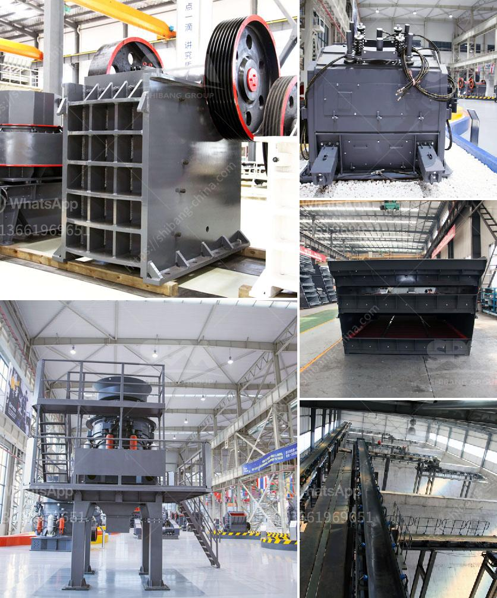

<h3>calcite grinding process</h3>
Calcite, also known as calcium carbonate, is a mineral that is commonly found in limestone and marble. It is a widely used industrial raw material, especially in the fields of manufacturing, construction, and chemical industries. One of the main applications of calcite is in the production of calcium carbonate powders, which are used as fillers in various products.

The grinding process is an essential step in the production of calcite powders, which require a finer particle size and a narrow distribution range. Grinding can be divided into two processes: crushing and grinding. Crushing refers to breaking large pieces of calcite into smaller ones, while grinding refers to the process of reducing the size of the calcite particles after crushing.

In the calcite grinding process, a Raymond mill, high-pressure suspension roller mill, ultrafine mill, and other equipment are commonly used. However, for small-scale production, small-scale grinding equipment such as Raymond mills and high-pressure suspension roller mills are often used. The specific process is as follows:

First, the calcite raw material enters the crushing equipment and is uniformly fed by the vibrating feeder for primary crushing. After the primary crushing stage, the crushed calcite particles are sent to the grinding equipment for grinding.

In the grinding equipment, the calcite particles are ground by roller grinding and impact grinding to achieve the desired fineness. The grinding process is accompanied by the circulation of air in the grinding chamber, which can effectively remove excessive heat and maintain the temperature within the specified range. This ensures the stability and quality of the calcite powder.

After grinding, the calcite powder is sifted through a vibrating screen to separate the desired particle size. The separated calcite powder is collected and stored for use in various applications such as the production of paints, coatings, plastics, and rubber products.

In conclusion, the grinding process is crucial in the production of calcite powders with the desired particle size and distribution range. It involves crushing the calcite raw material and grinding it using specialized equipment. This ensures the production of high-quality calcite powders that can be used in various industries.
<h3>Contact us</h3><ul><li><strong>Whatsapp:&nbsp;<a href="https://wa.me/8613661969651">+8613661969651</a></strong></li><li><a href="https://swt.shibang-china.com/?git&amp;zhl&amp;calcite grinding process"><strong>Online Service(chat now)</strong></a></li></ul><h3>Related</h3><ul><li><a href='fine grinding ball mills.md'>fine grinding ball mills</a></li><li><a href='crushing plants for sale in south africa.md'>crushing plants for sale in south africa</a></li><li><a href='two prefabricated concrete production line.md'>two prefabricated concrete production line</a></li><li><a href='powder ball milling machines.md'>powder ball milling machines</a></li><li><a href='limestone impact crusher wobbler.md'>limestone impact crusher wobbler</a></li></ul>