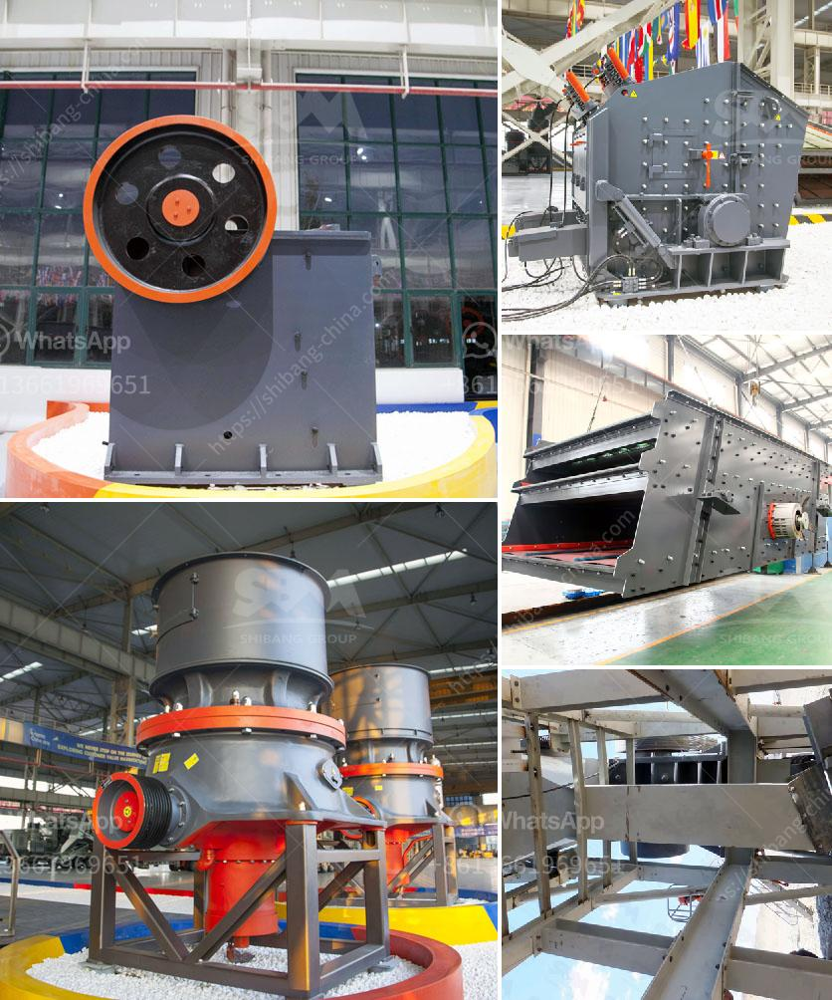

<h3>calcite powder manufacturer machines</h3>
Calcite powder is a widely used mineral in various industries such as plastics, paints, and rubber. Calcite powder manufacturer machines are essential in the calcite powder manufacturing process. These machines provide high-quality calcite powder to industries that need it.

Calcite powder is also known as calcium carbonate powder. It has a white and fine texture and is odorless. Calcite powder is insoluble in water and exhibits different physical and chemical properties than quartz and other minerals. Calcite powder is used as a filler in various industries due to its excellent transparency, acid resistance, and high temperature resistance.

Calcite powder manufacturer machines are used in the production of calcite powder. These machines are highly reliable and have been developed using state-of-the-art technology. The advanced manufacturing processes used in these machines ensure high-quality calcite powder production.

The process of manufacturing calcite powder involves several steps. First, calcite ore is crushed into a fine powder of the desired particle size. This powder is then fed into a special machine for further processing. The machine grinds the calcite into fine particles and separates them into different sizes using sieves. The finely ground calcite particles are then collected and packaged for distribution.

The calcite powder manufacturer machines have several features that make them popular in the industry. First, these machines have a high production capacity, allowing manufacturers to meet the increasing demand for calcite powder. Second, the machines have a compact design, taking up minimal space in the production facility. This ensures efficient use of the available space.

Furthermore, calcite powder manufacturer machines are easy to operate and require minimal maintenance. Manufacturers can set different production parameters to achieve the desired particle size and quality of the calcite powder. Additionally, the machines are equipped with safety features to prevent accidents and ensure operator safety.

The use of calcite powder has several advantages in various industries. In the plastics industry, calcite powder acts as a filler, enhancing the strength and durability of plastic products. It also improves the physical properties of plastics, such as impact resistance and heat resistance.

In the paint industry, calcite powder is used as an extender, improving the paint's durability and resistance to weathering. It also enhances the brightness and opacity of the paint, resulting in better coverage and color consistency.

In the rubber industry, calcite powder is utilized as a filler to improve the tensile strength and elasticity of rubber products. It also enhances the abrasion resistance and reduces the cost of raw materials.

Overall, calcite powder manufacturer machines play a crucial role in the production of high-quality calcite powder. These machines have revolutionized the manufacturing process, allowing manufacturers to meet the increasing demands of various industries. The use of calcite powder has several advantages, including improved product quality, durability, and cost-effectiveness. As the demand for calcite powder continues to grow, the development of advanced and efficient manufacturer machines will continue to play a vital role in the industry.
<h3>Contact us</h3><ul><li><strong>Whatsapp:&nbsp;<a href="https://wa.me/8613661969651">+8613661969651</a></strong></li><li><a href="https://swt.shibang-china.com/?git&amp;zhl&amp;calcite powder manufacturer machines"><strong>Online Service(chat now)</strong></a></li></ul><h3>Related</h3><ul><li><a href='gypsum washing equipment for sale.md'>gypsum washing equipment for sale</a></li><li><a href='pf impact crusher.md'>pf impact crusher</a></li><li><a href='kaolin manufacturing process.md'>kaolin manufacturing process</a></li><li><a href='concrete aggregate crushing plant.md'>concrete aggregate crushing plant</a></li><li><a href='gold hammer mills for sale south africa.md'>gold hammer mills for sale south africa</a></li></ul>