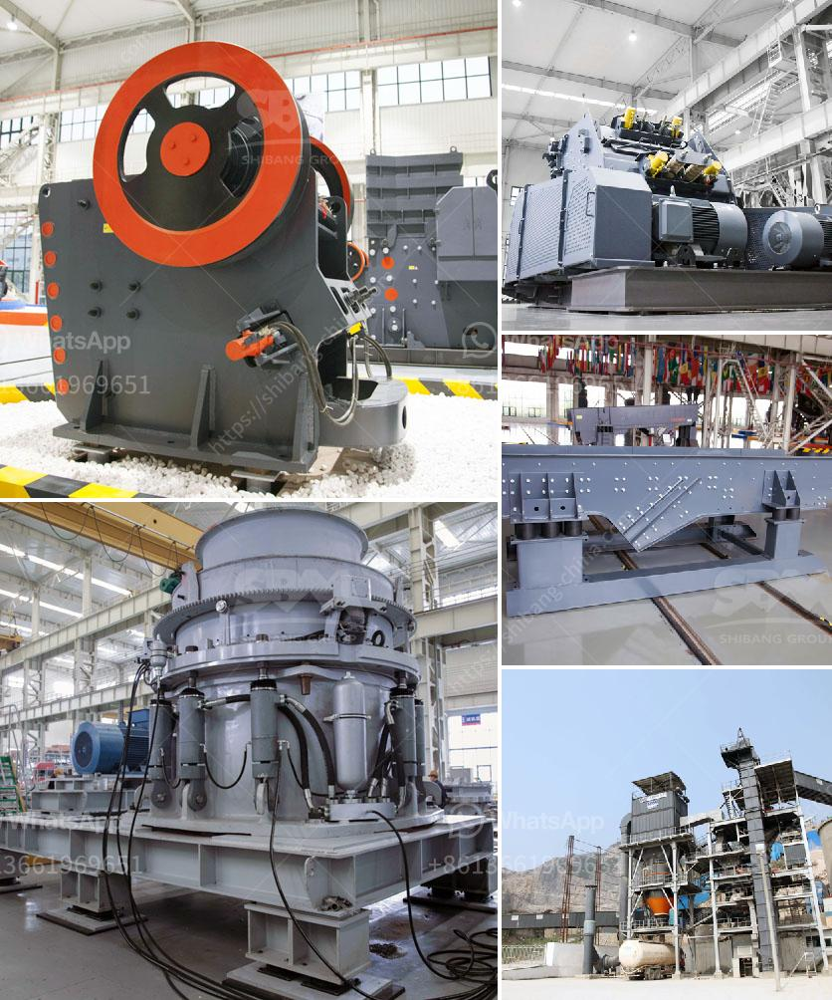

<h3>calcite processing plant</h3>
Calcite is a mineral with rich applications. It is commonly used in the construction industry for the production of cement, as a soil conditioner, and in the manufacturing of various everyday products such as glass, rubber, and paper. To fully utilize the potential of calcite, a calcite processing plant becomes an essential investment. With its advanced technology and machinery, the calcite processing plant provides a highly reliable and efficient solution for the industrial sector.

A calcite processing plant comprises a series of equipment that will work together to process the raw calcite into desired specifications. The primary crusher will crush the material into smaller particles which are then conveyed to the vibrating screen. The screen separates the crushed calcite into different grades based on size. The oversized particles will be sent back to the crusher for further crushing, while the correctly sized particles will be conveyed to the next stage.

The next stage involves the grinding process. The calcite particles are fed into a grinding mill where they are ground into fine powder. The grinding mill uses grinding media such as steel balls or ceramic beads to crush the calcite and create a fine powder. The fine powder is then conveyed to the storage silo through a pneumatic conveying system.

The final stage in the calcite processing plant is the packaging and storage of the processed calcite powder. The calcite powder is packaged in bags or bulk containers based on the requirements of the customers. The packaged calcite powder is then stored in warehouses or transported to various locations for distribution.

Investing in a calcite processing plant offers numerous advantages. Firstly, it allows businesses to have control over the quality and specifications of the calcite powder they produce, ensuring consistency and meeting the demands of their customers. Secondly, a calcite processing plant enables businesses to streamline their production process, increasing efficiency and reducing costs. Finally, by having their own processing plant, businesses can eliminate the need to rely on external suppliers, thereby reducing dependency and ensuring a steady supply of calcite.

In conclusion, a calcite processing plant is a vital investment for businesses in various industries. It provides a reliable and efficient solution for processing raw calcite into high-quality powder, enabling businesses to optimize their production processes and boost their overall productivity. By harnessing the full potential of calcite, businesses can enhance their competitiveness in the market and open up new opportunities for growth and success.
<h3>Contact us</h3><ul><li><strong>Whatsapp:&nbsp;<a href="https://wa.me/8613661969651">+8613661969651</a></strong></li><li><a href="https://swt.shibang-china.com/?git&amp;zhl&amp;calcite processing plant"><strong>Online Service(chat now)</strong></a></li></ul><h3>Related</h3><ul><li><a href='screener crusher china.md'>screener crusher china</a></li><li><a href='granite tiles processing machines.md'>granite tiles processing machines</a></li><li><a href='cement boll mill grinding media charging formula.md'>cement boll mill grinding media charging formula</a></li><li><a href='closing of crushing plant.md'>closing of crushing plant</a></li><li><a href='sell conveyor belts in south africa.md'>sell conveyor belts in south africa</a></li></ul>