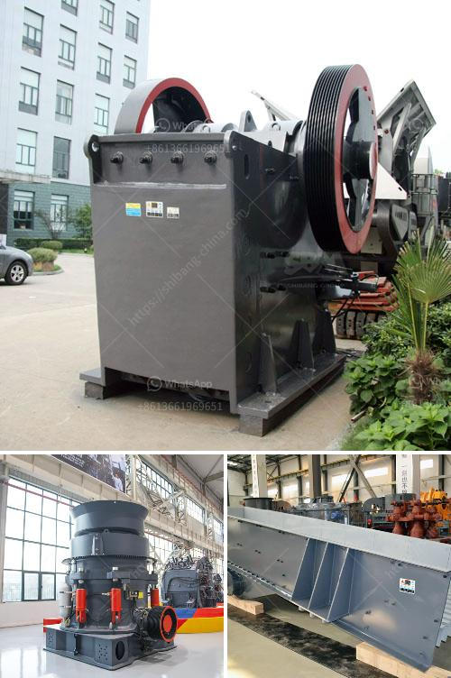

<h3>calcium ball mill</h3>
In the world of grinding technology, ball mills are renowned for their superior performance, versatility, and efficiency in producing fine powders. However, in recent years, there has been a growing demand for calcium-based powders, specifically calcium carbonate (CaCO3). This spike in demand can be attributed to the increasing use of calcium carbonate in various industries including pharmaceuticals, paints, paper, and rubber manufacturing. To meet this demand, engineers and scientists have developed a specialized grinding solution, known as the calcium ball mill.

The calcium ball mill is a high energy grinding mill that is used for particle size reduction in industries such as mining, ceramics, and chemicals. Composed of calcium-containing materials such as calcium oxide or calcium carbonate, the ball mill works by utilizing rotating balls or beads to crush and grind the material into a fine powder.

One of the key advantages of the calcium ball mill is its ability to produce ultra-fine powders. Traditional ball mills may not be able to achieve the desired particle size reduction due to limitations in their design and operation. However, the calcium ball mill overcomes these limitations by using specialized grinding media and a high-speed rotation mechanism. As a result, the calcium ball mill can produce powders with particle sizes ranging from a few micrometers to submicron levels.

Another advantage of the calcium ball mill is its efficiency in grinding calcium-based materials. Calcium carbonate, for instance, is notorious for its low grinding efficiency due to its low hardness and tendency to agglomerate. However, the calcium ball mill addresses these challenges by incorporating grinding media with high wear resistance, such as zirconia or alumina beads, which provide an efficient grinding surface without contaminating the processed material.

Furthermore, the calcium ball mill offers a versatile solution for grinding different types of calcium-based materials. It can grind not only calcium carbonate but also other calcium-containing minerals such as calcium phosphate and calcium sulfate. This versatility makes the calcium ball mill an ideal choice for industries that require precise control over particle size and distribution.

In addition to its superior grinding capabilities, the calcium ball mill also offers benefits such as energy efficiency and environmental sustainability. Compared to traditional grinding methods, the calcium ball mill consumes less energy per unit of material processed, resulting in reduced operational costs. Moreover, the use of specialized grinding media eliminates the need for additional chemicals or additives, making the process more environmentally friendly.

Overall, the calcium ball mill is a high energy grinding solution that offers numerous advantages for industries requiring ultra-fine powders and efficient particle size reduction. With its ability to grind various calcium-based materials, versatility, and eco-friendly operation, the calcium ball mill is poised to revolutionize the production of calcium carbonate and other calcium-based powders across various industries. As demand continues to grow, it is likely that the calcium ball mill will become an essential tool in the arsenal of manufacturers aiming to meet the increasing need for calcium-based materials.
<h3>Contact us</h3><ul><li><strong>Whatsapp:&nbsp;<a href="https://wa.me/8613661969651">+8613661969651</a></strong></li><li><a href="https://swt.shibang-china.com/?git&amp;zhl&amp;calcium ball mill"><strong>Online Service(chat now)</strong></a></li></ul><h3>Related</h3><ul><li><a href='conveyor belts supplier malaysia.md'>conveyor belts supplier malaysia</a></li><li><a href='stone crusher second hand south africa.md'>stone crusher second hand south africa</a></li><li><a href='complete aggregate crushing plant in usa.md'>complete aggregate crushing plant in usa</a></li><li><a href='gold washing machine for sale in tanzania.md'>gold washing machine for sale in tanzania</a></li><li><a href='pf impact crusher.md'>pf impact crusher</a></li></ul>