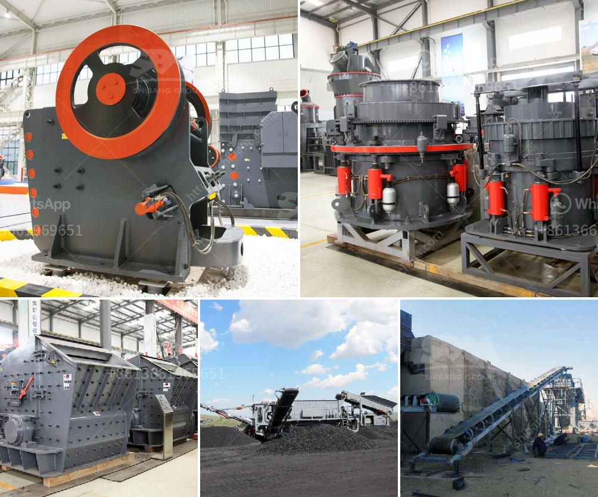

<h3>calcium carbonate ball mill</h3>
A ball mill is a type of grinder used to grind materials into extremely fine powder, specifically for use in mineral dressing processes. Calcium carbonate ball mill is widely used in grinding clinker, carbonate, fireproof stuff , and chemical materials , also can be used in beneficiation industry, metallurgy, chemical industry and so on.

The calcium carbonate ball mill is a horizontal rotating device transmitted by the outer gear. The materials are transferred to the grinding chamber through the quill shaft uniformly. There are ladder liner and ripple liner and different specifications of steel balls in the chamber. The centrifugal force caused by rotation of barrel brings the steel balls to a certain height and impact and grind the materials.

Calcium carbonate ball mill is composed of feeding part, discharging part, turning part and driving part (reducer, small driving gear, electric motor and electric control). The quill shaft adopts cast steel part and the liner is detachable. The turning gearwheel adopts casting hobbing process and the drum is equipped with wear-resistant liner, which has good wear-resistance. The machine is with stable and reliable working condition.

Calcium carbonate ball mill is suitable for grinding various ores and other materials. It is widely used in mineral processing, building materials and chemical industries. It can be divided into dry and wet grinding methods. According to different mining methods, it can be divided into two types: lattice type and overflow type.

In the production of calcium carbonate ball mill, energy consumption is relatively high. For grinding calcium carbonate, the use of ball mill is indispensable for many enterprises. The technical indicators of ball mill have reached the advanced level. However, there are still some problems, such as, low grinding efficiency, high energy consumption, and uneven product fineness. To solve these problems, we should analyze the working principle of calcium carbonate ball mill, optimize the structure parameters of the ball mill, and improve the grinding ability of the ball mill.

Firstly, reduce the particle size of the material and bring it to the uniform particle size required by the product, and then improve the efficiency of the ball mill grinding.

Secondly, it is necessary to increase the drying capacity of the mill. If the moisture content of the material is too high during grinding, it will cause the material to adhere to the ball mill, which will affect the efficiency of grinding and endanger the safe operation of the equipment. Therefore, the moisture content of the material should be strictly controlled.

Finally, the speed of the ball mill should be adjusted reasonably according to the characteristics of the material, the size of the product, and the requirements of the grinding process. In the production process, the operator should pay attention to observe the running condition of the ball mill and timely adjust the parameters to ensure the stable operation of the equipment.

In conclusion, the calcium carbonate ball mill is an efficient tool for fine powder grinding. It is widely used in the industries of metallurgy, mining, cement, building materials, chemical, fireproof materials, ceramics, etc. The ball mill can grind various ores and other materials either wet or dry.
<h3>Contact us</h3><ul><li><strong>Whatsapp:&nbsp;<a href="https://wa.me/8613661969651">+8613661969651</a></strong></li><li><a href="https://swt.shibang-china.com/?git&amp;zhl&amp;calcium carbonate ball mill"><strong>Online Service(chat now)</strong></a></li></ul><h3>Related</h3><ul><li><a href='sell jaw crusher.md'>sell jaw crusher</a></li><li><a href='price of conveyor belt.md'>price of conveyor belt</a></li><li><a href='limestone processing plant philippines.md'>limestone processing plant philippines</a></li><li><a href='small scale gold processing machines price list.md'>small scale gold processing machines price list</a></li><li><a href='ball mill capacity 26 x 41.md'>ball mill capacity 26 x 41</a></li></ul>