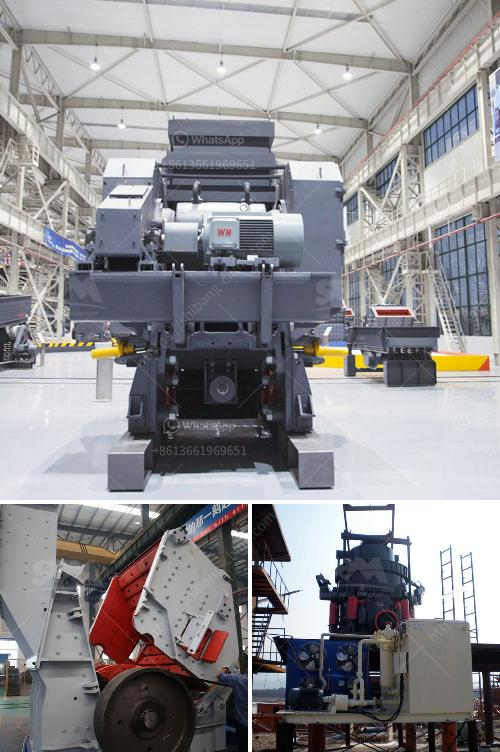

<h3>calcium carbonate grinding ball mill</h3>
Calcium carbonate grinding ball mill is a key equipment for regrinding. It is widely used for the cement, the silicate product, new type building material, fire-proof material, chemical fertilizer, black and non-ferrous metal, glass, ceramics and etc. The ball mill can grind ore or other materials that can be grinded either by wet process or by dry process. Features of Calcium Carbonate Grinding Ball Mill:

Calcium carbonate grinding mill is the key equipment for grinding after the crushing process, which is widely used in the manufacture industries, such as cement, silicate, new building material, refractory material, fertilizer, ferrous metal, nonferrous metal and glass ceramics and can be used for the dry and wet grinding for all kinds of ores and other grindable materials.

Calcium carbonate grinding ball mill is the most widely used grinding machine for calcium carbonate. It has won the favor of customers at home and abroad. Calcium carbonate grinding ball mill has a large production capacity, low energy consumption, low investment cost, large fineness of finished product, low operating cost, wide application range, and is an ideal fine grinding equipment for the vast number of users at home and abroad.

Overall, the calcium carbonate grinding ball mill is a reliable machine that can effectively grind calcium carbonate. This mill has a durable structure and keeps the grinding media inside the mill longer, which can effectively reduce the maintenance time and cost. The ball mill is widely used in the manufacture of cement, silicate products, new building materials, refractories, fertilizers, black and non-ferrous metal beneficiation and glass-ceramic production industries, and various ores and other grindable materials are dry or wet milled.
<h3>Contact us</h3><ul><li><strong>Whatsapp:&nbsp;<a href="https://wa.me/8613661969651">+8613661969651</a></strong></li><li><a href="https://swt.shibang-china.com/?git&amp;zhl&amp;calcium carbonate grinding ball mill"><strong>Online Service(chat now)</strong></a></li></ul><h3>Related</h3><ul><li><a href='process of cement.md'>process of cement</a></li><li><a href='gypsum washing equipment for sale.md'>gypsum washing equipment for sale</a></li><li><a href='tones per hour in limestone prduction.md'>tones per hour in limestone prduction</a></li><li><a href='clinker crsher plant for sale.md'>clinker crsher plant for sale</a></li><li><a href='small scale mining project proposal.md'>small scale mining project proposal</a></li></ul>