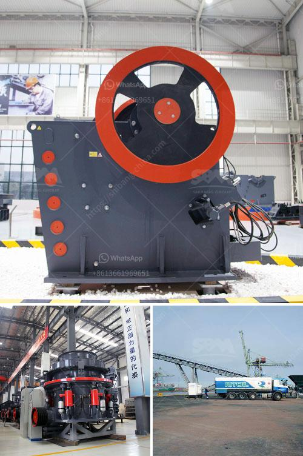

<h3>calcium carbonate powder machine</h3>
Calcium carbonate is a compound commonly found in rocks, shells, and even pearls. It is one of the most abundant minerals on the planet and has various applications in different industries. Calcium carbonate powder machines, also known as calcium carbonate grinding mills, are machines used to process the calcium carbonate into fine powder in a precise manner.

These machines are widely used in various industries such as mining, construction, and chemical manufacturing. In the mining industry, calcium carbonate powder machines are used to grind limestone, marble, chalk, and other rocks into smaller particles, making it easier to extract valuable minerals from them. In the construction industry, these machines are used to produce fine-grained concrete, which is essential for the creation of strong and durable structures. In the chemical manufacturing industry, calcium carbonate powder machines are used to produce high-quality fillers for paint, rubber, plastics, and adhesives.

One of the main advantages of using calcium carbonate powder machines is their versatility. These machines can process a wide range of materials with different hardness levels and particle sizes. They can produce fine powder with precise particle sizes as per the requirements of the industry. Moreover, these machines are capable of producing large quantities of calcium carbonate powder, making them ideal for industries with high production demands.

Another advantage of calcium carbonate powder machines is their high efficiency and energy-saving features. These machines are designed with advanced technology to ensure maximum productivity while minimizing energy consumption. They are equipped with powerful motors and efficient grinding systems, which enable them to grind large quantities of calcium carbonate ore within a short period. This not only improves the productivity of industries but also reduces their energy costs, making them a cost-effective solution for calcium carbonate processing.

In conclusion, calcium carbonate powder machines are essential tools in various industries due to their versatility, efficiency, and cost-effectiveness. They provide an efficient and precise way to process calcium carbonate into fine powder, which is widely used in industries such as mining, construction, and chemical manufacturing. With the advancements in technology, these machines continue to evolve, offering more efficient and environmentally friendly solutions for calcium carbonate processing.
<h3>Contact us</h3><ul><li><strong>Whatsapp:&nbsp;<a href="https://wa.me/8613661969651">+8613661969651</a></strong></li><li><a href="https://swt.shibang-china.com/?git&amp;zhl&amp;calcium carbonate powder machine"><strong>Online Service(chat now)</strong></a></li></ul><h3>Related</h3><ul><li><a href='mica mill roller mill.md'>mica mill roller mill</a></li><li><a href='coal washing plant in philippines south africa.md'>coal washing plant in philippines south africa</a></li><li><a href='stone crushers in china.md'>stone crushers in china</a></li><li><a href='manganese wash plant zambia.md'>manganese wash plant zambia</a></li><li><a href='sell of used dolomite roller mill in india.md'>sell of used dolomite roller mill in india</a></li></ul>