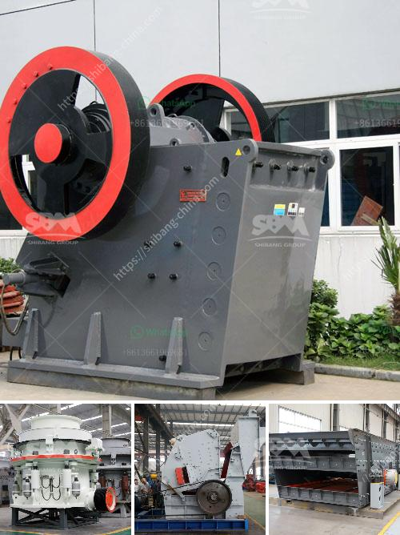

<h3>calcium carbonate production line picture</h3>
Calcium carbonate is a common mineral found in rocks, shells, and other natural sources. It is widely used in various industries, including paper, plastics, paints, coatings, and pharmaceuticals. The production of calcium carbonate involves several steps, which are typically carried out in a calcium carbonate production line.

A calcium carbonate production line is a complete system that includes crushers, screens, feeders, and other equipment used to handle and process calcium carbonate. The raw material is extracted from the quarry or mines and undergoes a series of crushing and screening processes to transform it into different sizes or grades.

The first step in the production line is the extraction of calcium carbonate from the quarry. This is usually done through blasting or drilling to access the calcium carbonate deposits. The extracted material is then crushed into smaller pieces using crushers. These crushers can be jaw crushers, impact crushers, or cone crushers, depending on the desired size and shape of the calcium carbonate.

Once the material has been crushed, it is screened to separate different sizes of calcium carbonate. Screens with different mesh sizes are used to achieve the desired particle size distribution. The screened material is then conveyed to storage or further processed to meet specific requirements.

In some cases, the calcium carbonate needs to undergo additional processing steps to enhance its properties. For example, the material may need to be ground to a finer particle size or subjected to surface modification to improve its dispersibility in a particular application.

The production line also includes various auxiliary equipment, such as feeders and conveyors, to transport the material between different stages of the process. The feeders ensure a continuous supply of the raw material to the crushers, while the conveyors transport the crushed material to the screening and storage areas.

A well-designed calcium carbonate production line should consider factors such as the quality and purity of the final product, the efficiency of the process, and the safety and environmental impact of the operations. Modern production lines incorporate advanced technologies and automation systems to optimize the production process and minimize resource consumption and waste generation.

In summary, a calcium carbonate production line is a complex system that involves various equipment and processes to transform raw material into high-quality calcium carbonate products. The production line typically includes crushers, screens, feeders, and auxiliary equipment to handle and process the material. The goal is to achieve the desired particle size distribution and other properties required for different applications. Through efficient and sustainable production practices, calcium carbonate production lines contribute to the supply of this essential mineral to industries worldwide.
<h3>Contact us</h3><ul><li><strong>Whatsapp:&nbsp;<a href="https://wa.me/8613661969651">+8613661969651</a></strong></li><li><a href="https://swt.shibang-china.com/?git&amp;zhl&amp;calcium carbonate production line picture"><strong>Online Service(chat now)</strong></a></li></ul><h3>Related</h3><ul><li><a href='diesel compressors for sale in south africa.md'>diesel compressors for sale in south africa</a></li><li><a href='stone crusher gangs in jamaica.md'>stone crusher gangs in jamaica</a></li><li><a href='grinding mill machine cost price south africa.md'>grinding mill machine cost price south africa</a></li><li><a href='price of stone crusher plant.md'>price of stone crusher plant</a></li><li><a href='stone ball mill up to 2500 mesh.md'>stone ball mill up to 2500 mesh</a></li></ul>