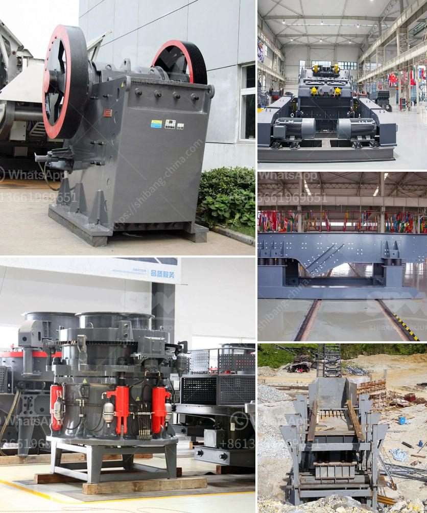

<h3>calcium silicone crushers</h3>
Calcium silicone crushers are a type of grinder used to grind calcium silicone minerals into fine powder. These crushers are widely used in the mining industry for crushing and grinding various materials, such as limestone, coal, gypsum, barite, dolomite and other minerals.

Calcium silicones are mineral compounds composed of calcium, silicon, and oxygen atoms. They are primarily used in various industrial applications due to their high melting points and excellent heat resistance. Calcium silicone crushers are designed specifically to crush calcium silicone minerals to obtain the desired particle size.

These crushers work by applying high pressure to the material being crushed, forcing it to break and fracture under compression. The crushed material is then subjected to further grinding and milling to achieve the desired fine powder size. The crushing process ensures that the calcium silicone minerals are reduced to the size required for specific applications.

One of the primary applications of calcium silicone crushers is in the production of calcium silicone powders. These powders are widely used in industries such as metallurgy, ceramics, and plastics. In the metallurgical industry, calcium silicone powders are used as a deoxidizer and desulfurizer in the steelmaking process. They help remove impurities and improve the quality of the final steel product.

In the ceramics industry, calcium silicone powders are used as raw materials to produce high-quality ceramic products. The powders enhance the strength and durability of ceramic materials, making them suitable for various applications, including construction, home décor, and electrical components.

Calcium silicone crushers are also used in the production of plastics. The fine powders obtained from these crushers are added to plastic formulations to enhance their mechanical properties and thermal stability. They improve the strength, heat resistance, and flame-retardant properties of plastics, making them suitable for a wide range of applications, including automotive, electronics, and packaging.

Furthermore, calcium silicone crushers are also used in the production of fertilizers. The fine powders obtained from these crushers are added to fertilizers to improve their nutrient content and efficiency. Calcium silicone minerals provide essential nutrients, such as calcium and silicon, to plants, promoting healthy growth and improving crop yields.

In summary, calcium silicone crushers play a vital role in various industrial applications. They are specifically designed to crush and grind calcium silicone minerals, producing fine powders that are used in industries such as metallurgy, ceramics, plastics, and fertilizers. These crushers help improve the properties of various materials, enhancing their performance and increasing their applications in different industries.
<h3>Contact us</h3><ul><li><strong>Whatsapp:&nbsp;<a href="https://wa.me/8613661969651">+8613661969651</a></strong></li><li><a href="https://swt.shibang-china.com/?git&amp;zhl&amp;calcium silicone crushers"><strong>Online Service(chat now)</strong></a></li></ul><h3>Related</h3><ul><li><a href='gold mining crusher machinery.md'>gold mining crusher machinery</a></li><li><a href='stone crushers turkey.md'>stone crushers turkey</a></li><li><a href='grinder mill powder singapore.md'>grinder mill powder singapore</a></li><li><a href='stone crusher dijual.md'>stone crusher dijual</a></li><li><a href='crushers of crushers.md'>crushers of crushers</a></li></ul>