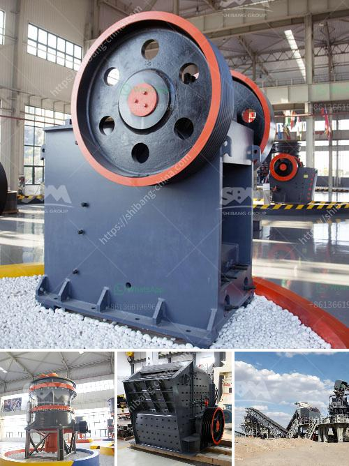

<h3>california rock crusher machine</h3>
California rock crusher machine is a heavy-duty equipment that is used to reduce large rocks into smaller pieces or rock dust. These machines are also used to crush stones, sand, gravel, rock, iron, copper ore, limestone, and other minerals.

California rock crushers are machine devices that are designed to reduce the size of large rocks in a controlled manner, efficiently and safely. These machines are operated by trained professionals who have extensive knowledge of rock crushing and screening techniques. The machine is equipped with powerful hydraulic jaws or hammers that crush the rocks into smaller pieces.

The crushed rocks obtained from the California rock crusher machine are used for various construction purposes, including road building, landscaping, and foundation work. These crushed rocks are also used in the production of concrete, asphalt, and cement. The machine is capable of reducing rocks of different sizes, ranging from a few inches to several feet in diameter.

One of the key features of the California rock crusher machine is its ability to produce uniform-sized rocks. The machine crushes the rocks in a consistent manner, ensuring that the final product has a similar size and shape. This is important in construction applications, as it helps in achieving consistency in the finished product.

The California rock crusher machine is equipped with safety features to ensure that accidents or injuries are minimized during the crushing process. These safety features include advanced warning systems, emergency stop buttons, and interlocks that prevent unauthorized access to the machine while it is in operation. Additionally, trained professionals operate the machine, ensuring that all safety guidelines and protocols are followed.

California rock crusher machines are available in different models, each designed for specific tasks. Some machines are mobile, allowing them to be transported to different locations for on-site crushing. Other machines are stationary and are designed to be installed permanently at a specific site.

The popularity of California rock crusher machines can be attributed to their efficiency and cost-effectiveness. These machines can process large quantities of rocks in a short period, thereby reducing the time and labor required for crushing rocks manually. Additionally, the machines are robust and durable, capable of withstanding harsh weather conditions and continued heavy usage.

In conclusion, California rock crusher machines are essential equipment in the construction industry. They are used to crush large rocks into smaller pieces or rock dust, which is then used for various construction purposes. These machines are reliable, efficient, and safe, with various safety features in place. Whether for road building, landscaping, or foundation work, California rock crusher machines play a crucial role in the construction industry's success.
<h3>Contact us</h3><ul><li><strong>Whatsapp:&nbsp;<a href="https://wa.me/8613661969651">+8613661969651</a></strong></li><li><a href="https://swt.shibang-china.com/?git&amp;zhl&amp;california rock crusher machine"><strong>Online Service(chat now)</strong></a></li></ul><h3>Related</h3><ul><li><a href='cost of crushing and screening.md'>cost of crushing and screening</a></li><li><a href='quarry crusher plant in ethiopia.md'>quarry crusher plant in ethiopia</a></li><li><a href='mineral industrial crusher.md'>mineral industrial crusher</a></li><li><a href='coal crushing and screening plant.md'>coal crushing and screening plant</a></li><li><a href='calcite powder manufacturer machines.md'>calcite powder manufacturer machines</a></li></ul>