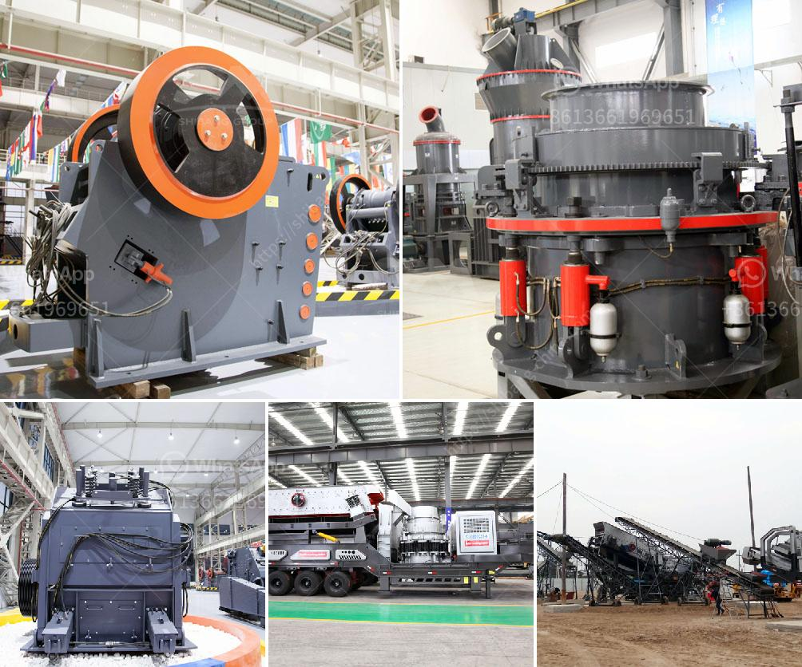

<h3>capacity of cone crusher</h3>
The cone crusher is one of the most common types of crushing equipment on the market. With its ability to crush hard and abrasive materials, the cone crusher is more popular than ever. So how does it work?

A cone crusher consists of a mantle or cone, which is a concave surface that’s usually made of manganese steel. The crushing chamber in the cone crusher is formed between the mantle and the concave, which ensures efficient and uniform crushing.

The capacity of a cone crusher is measured in the tons per hour (TPH) of the materials being crushed. The capacity can range from 100 TPH to 300 TPH depending on the machine model and the desired output size. The cone crusher is often used as a secondary or tertiary crushing device, which makes it more efficient for crushing materials of different sizes.

When it comes to the capacity of the cone crusher, there are several factors that can affect it. One of the main factors is the feed size. Larger feed sizes will have a lower capacity as the crusher will require more time to crush the material.

Another factor is the type of material being crushed. Harder and more abrasive materials will take longer to crush, reducing the overall capacity. Softer materials can be crushed more quickly, increasing the capacity.

The speed of the cone crusher also affects its capacity. Higher speeds result in better crushing performance, but they also require more power. Lower speeds, on the other hand, may result in lower capacity but can be more cost-effective if the desired output size is achieved.

In conclusion, the capacity of a cone crusher can vary from 100 TPH to 300 TPH depending on several factors. These include the feed size, type of material, and speed of operation. Understanding the capacity of the cone crusher is essential for finding the right machine for your crushing needs.
<h3>Contact us</h3><ul><li><strong>Whatsapp:&nbsp;<a href="https://wa.me/8613661969651">+8613661969651</a></strong></li><li><a href="https://swt.shibang-china.com/?git&amp;zhl&amp;capacity of cone crusher"><strong>Online Service(chat now)</strong></a></li></ul><h3>Related</h3><ul><li><a href='gold crusher philippines.md'>gold crusher philippines</a></li><li><a href='stone quarry crusher project report pdf.md'>stone quarry crusher project report pdf</a></li><li><a href='stone crusher machine supplier.md'>stone crusher machine supplier</a></li><li><a href='mineral plant bauxite ore crushing plant.md'>mineral plant bauxite ore crushing plant</a></li><li><a href='stone crusher portable.md'>stone crusher portable</a></li></ul>