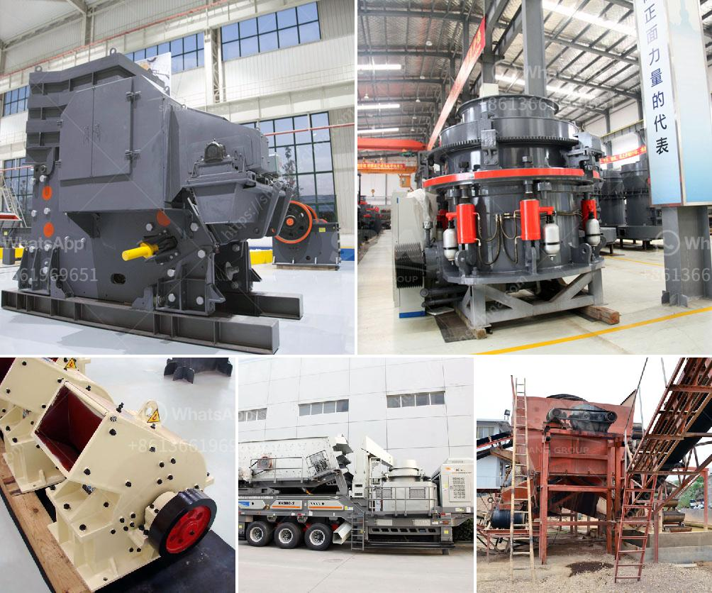

<h3>capital cost gold processing plant</h3>
A capital cost gold processing plant is a significant investment for any company, with the potential to make or break its profitability. Therefore, it is essential to evaluate the feasibility and economics of such a project thoroughly. In this article, we will discuss the factors impacting capital cost estimates for a gold processing plant.

One of the primary considerations when estimating the capital cost of a gold processing plant is the size and scalability of the operation. A small-scale plant will require less equipment, infrastructure, and manpower than a large-scale one. However, the economies of scale may kick in at a certain size, reducing the cost per ounce of gold produced.

The choice of processing technology also influences the capital cost. There are several ways to extract gold from ore, including cyanide leaching, gravity separation, and flotation. Each method comes with its own specific equipment requirements and associated costs. For instance, a cyanide leaching plant would need a dedicated cyanide storage and distribution system, which can significantly add to the capital cost.

The location of the plant is another critical factor. Accessibility to infrastructure, reliable power supply, and a skilled labor force can significantly reduce capital costs. A remote, inaccessible site may require additional investments in transportation, power generation, and worker accommodation.

Regulatory requirements and environmental considerations also impact the capital cost of a gold processing plant. Compliance with health, safety, and environmental standards often requires additional equipment, containment systems, and monitoring devices. Carrying out an environmental impact assessment and obtaining the necessary permits can also contribute to the overall cost.

Other cost factors include the type and quality of equipment used, the extent of site preparation required, and the level of automation implemented. High-quality equipment may have a higher upfront cost but can reduce operational expenses and increase efficiency in the long run. Extensive site preparation, such as leveling, clearing, and infrastructure installation, can also add to the capital cost. Similarly, a higher degree of automation can improve productivity but may require substantial upfront investments.

Project-specific factors such as construction timelines, project management costs, financing options, and risk assessment can further impact capital cost estimates. It is crucial to account for contingencies, such as delays in obtaining permits or unexpected cost overruns, to ensure a realistic estimate.

To conclude, estimating the capital cost of a gold processing plant requires a comprehensive understanding of various factors. The size of the operation, choice of processing technology, plant location, regulatory requirements, equipment quality, site preparation, level of automation, and project-specific considerations all contribute to the capital cost. Conducting a thorough feasibility study and cost analysis is crucial to ensure the financial viability of the plant and maximize returns on investment.
<h3>Contact us</h3><ul><li><strong>Whatsapp:&nbsp;<a href="https://wa.me/8613661969651">+8613661969651</a></strong></li><li><a href="https://swt.shibang-china.com/?git&amp;zhl&amp;capital cost gold processing plant"><strong>Online Service(chat now)</strong></a></li></ul><h3>Related</h3><ul><li><a href='rock crusher plant price.md'>rock crusher plant price</a></li><li><a href='alluvial gold plants for sale south africa.md'>alluvial gold plants for sale south africa</a></li><li><a href='pf impact crusher.md'>pf impact crusher</a></li><li><a href='price of crusher.md'>price of crusher</a></li><li><a href='gravel making crusher.md'>gravel making crusher</a></li></ul>