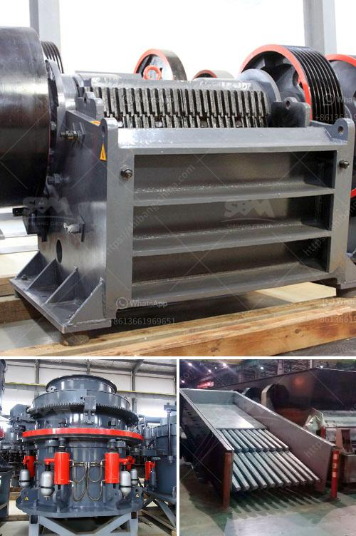

<h3>carbomer ball mill</h3>
Carbomer is a thickening agent that helps control the viscosity and flow of cosmetic products. It is a common ingredient in skincare, haircare, and personal care products. One of the most effective ways to disperse and blend carbomer powders into liquid formulations is by using a ball mill.

Carbomer is a high molecular weight polymer made from acrylic acid monomers. It is hydrophilic and forms a gel when combined with water. However, mixing and dispersing carbomer powder into water or other solvents can be challenging due to its high viscosity and tendency to clump. This is where a ball mill comes in handy.

A ball mill is a type of grinder that is used to blend and grind materials for use in various applications. It works by rotating a cylinder filled with balls, which cause the balls to fall back into the cylinder and onto the material being ground. The rotation of the cylinder creates a centrifugal force that can effectively disperse and blend powders.

When using a ball mill to mix carbomer powder, the first step is to load the mill with balls. The balls are generally made from stainless steel or ceramic materials. However, due to the abrasive nature of carbomer, stainless steel balls are recommended as they are more resistant to wear and tear.

Once the ball mill is loaded with balls, the carbomer powder is added to the mill along with the liquid formulation. The mill is then turned on, and the combination of the rotating balls and the centrifugal force created by the mill's rotation helps break down the carbomer powder into smaller particles.

As the powders are milled, the carbomer particles start to disperse and blend with the liquid, resulting in a smooth and homogeneous mixture. The ball mill ensures that the carbomer is evenly distributed throughout the liquid, preventing clumping and allowing for easier incorporation into the final product.

The milling process can be adjusted to control the fineness and texture of the carbomer particles. Longer milling times result in finer particles, while shorter milling times produce coarser particles. The desired particle size depends on the specific formulation and its intended use.

In conclusion, a ball mill is a valuable tool for dispersing and blending carbomer powders into liquid formulations. It helps overcome the challenges of carbomer's high viscosity and clumping tendencies. By using a ball mill, manufacturers can ensure a uniform and smooth consistency, resulting in high-quality products.
<h3>Contact us</h3><ul><li><strong>Whatsapp:&nbsp;<a href="https://wa.me/8613661969651">+8613661969651</a></strong></li><li><a href="https://swt.shibang-china.com/?git&amp;zhl&amp;carbomer ball mill"><strong>Online Service(chat now)</strong></a></li></ul><h3>Related</h3><ul><li><a href='silver copper cone crusher.md'>silver copper cone crusher</a></li><li><a href='concrete waste crusher plant malaysia.md'>concrete waste crusher plant malaysia</a></li><li><a href='product of crushing plant.md'>product of crushing plant</a></li><li><a href='slag processing plant manufacturers in chile.md'>slag processing plant manufacturers in chile</a></li><li><a href='self healing process of limestone.md'>self healing process of limestone</a></li></ul>