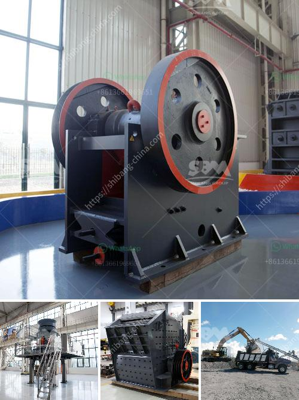

<h3>carbonate calcium of ball mill</h3>
Carbonate calcium is a chemical compound with the formula CaCO3. It is a common substance found in rocks as the minerals calcite and aragonite (most notably as limestone, which contains both of those minerals) and is the main component of pearls and the shells of marine organisms, snails, and eggs. Calcium carbonate is used widely as an effective dietary supplement, antacid, phosphate binder, or base material for medicinal tablets, as well as an inert filler or pigment in tablet formulations.

Ball milling is a mechanical process used to reduce the size of particles and blend materials. It works with the principle of impact and attrition: the size reduction is achieved through the collision of the balls with the material to be milled, along with the balls themselves rotating in the container. The process can be used for a wide range of applications, including producing powders for coatings, pigments, and ceramics, as well as grinding minerals, ores, and other materials.

When it comes to carbonate calcium, ball milling is often used as a primary method to produce fine and ultra-fine calcium carbonate powder. Calcium carbonates produced through ball milling are suitable for high-performance applications, such as fillers in the polymer, paint, paper, adhesive, and pharmaceutical industries, thanks to their controlled particle size distribution, fine particle morphology, and narrow particle size distribution.

In the ball milling process, a ball mill is used to grind and blend bulk materials into fine powders. It uses a rotating cylindrical container with grinding balls, such as steel or ceramic, to pulverize the material being milled. The rotation of the container causes the balls to cascade and impact the material, resulting in particle size reduction.

For carbonate calcium, the ball milling process involves several steps. Firstly, the limestone or marble rock is extracted from the quarry and crushed into smaller pieces. Then it is fed into a ball mill along with the grinding balls. As the mill rotates, the balls crush and grind the limestone or marble particles into a powder.

During this process, it is crucial to control various parameters to achieve the desired particle size distribution and morphology. The speed of the mill, the size and number of grinding balls, the duration of milling, and the addition of dispersants or additives can all affect the final product properties. Consequently, the milling process is optimized to achieve the desired particle size and structure, ensuring that the resulting carbonate calcium powder meets the specific requirements of the end-user.

The advantages of using ball milling to produce carbonate calcium powders are numerous. Firstly, it allows for the production of fine and ultra-fine powders, which can enhance the performance of various applications. Secondly, the process is scalable, making it suitable for both small-scale and large-scale production. Finally, ball milling offers a cost-effective solution for producing calcium carbonates, as it requires minimal energy input and has lower operating costs compared to other size reduction methods.

In conclusion, carbonate calcium produced through ball milling is a widely used and versatile material in various industries. The process of ball milling allows for the production of fine and ultra-fine calcium carbonate powders, with controlled particle size distribution and morphology. With its numerous advantages, including scalability and cost-effectiveness, ball milling is a preferred method for producing calcium carbonates for a range of applications.
<h3>Contact us</h3><ul><li><strong>Whatsapp:&nbsp;<a href="https://wa.me/8613661969651">+8613661969651</a></strong></li><li><a href="https://swt.shibang-china.com/?git&amp;zhl&amp;carbonate calcium of ball mill"><strong>Online Service(chat now)</strong></a></li></ul><h3>Related</h3><ul><li><a href='german zenith made mobile stone crusher.md'>german zenith made mobile stone crusher</a></li><li><a href='machinery for starch plant japan.md'>machinery for starch plant japan</a></li><li><a href='limestone crusher manufacturers price.md'>limestone crusher manufacturers price</a></li><li><a href='gold processing crusher.md'>gold processing crusher</a></li><li><a href='ballast crushing machine kenya.md'>ballast crushing machine kenya</a></li></ul>