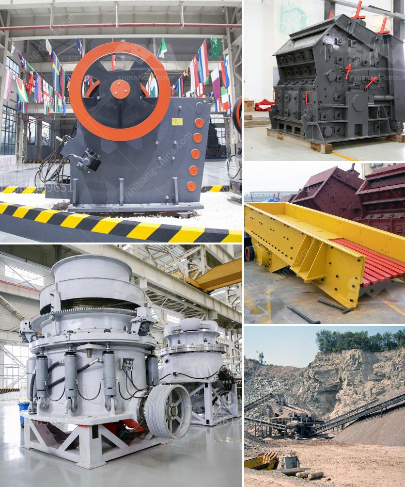

<h3>cement ball mill design pdf</h3>
Cement ball mill design pdf has revolutionized the cement industry by significantly reducing energy consumption and improving initial and final cement quality. It offers efficient grinding and minimum overgrinding, with a narrow particle size distribution, thanks to its advanced design. It utilizes a rotating cylindrical chamber filled with grinding media, such as steel balls, to create optimum conditions for grinding, resulting in finer cement particles.

The design of cement ball mills aims at delivering high grinding efficiency and good flowability of cement, which is key to reducing energy consumption. To achieve this, designers optimize mill dimensions, ensuring the grinding media is at the correct height, and mill speed is optimized to provide the desired impact forces to grind the material. This is achieved through careful calculations and simulations, taking into consideration mill power, grinding media size and shape, and material properties.

Furthermore, cement ball mill design takes into account the lining design, which influences the ball mill's productivity and wear rate. Liners provide the necessary protection to the mill shell and optimize the grinding efficiency. While different mill designs are available, each with their unique advantages, all of them aim to provide a cost-effective and sustainable solution for the cement industry.

In conclusion, cement ball mill design pdf has revolutionized the cement industry by allowing for a more energy-efficient grinding process and improving cement quality. The design ensures that the grinding media are at the correct height and optimal mill speed is achieved for maximum impact forces. Additionally, the lining design plays a vital role in maintaining the productivity and longevity of the mill. With ongoing advancements in technology and design, cement ball mills are continuously evolving to meet the industry's ever-changing demands.
<h3>Contact us</h3><ul><li><strong>Whatsapp:&nbsp;<a href="https://wa.me/8613661969651">+8613661969651</a></strong></li><li><a href="https://swt.shibang-china.com/?git&amp;zhl&amp;cement ball mill design pdf"><strong>Online Service(chat now)</strong></a></li></ul><h3>Related</h3><ul><li><a href='stone mill grinder price.md'>stone mill grinder price</a></li><li><a href='cone crusher 100tph prices in india.md'>cone crusher 100tph prices in india</a></li><li><a href='how to make a business plan for crusher plant.md'>how to make a business plan for crusher plant</a></li><li><a href='graphite beneficiation process.md'>graphite beneficiation process</a></li><li><a href='tph granite crushing plant for sale.md'>tph granite crushing plant for sale</a></li></ul>