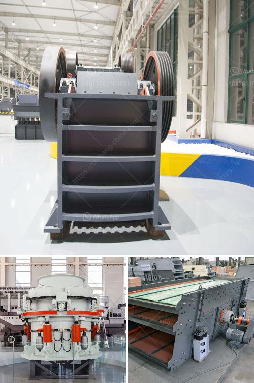

<h3>cement boll mill grinding media charging formula</h3>
Cement is an essential component in construction projects as it acts as a binder that sets and hardens to adhere to building materials like bricks, stones, metal, and more. Cement manufacturing involves a grinding process known as the boll mill, which utilizes steel balls to pulverize the raw materials into a fine powder.

The grinding media in a boll mill can be made of various materials, but it is typically made of steel balls. When the ball mill rotates, the balls crush and grind the materials into a powdered form. This process not only makes the cement powder finer but also allows for better blending, hydration, and chemical reactions, resulting in a stronger and more durable final product.

To achieve the desired grinding efficiency in a ball mill, it is crucial to select the appropriate grinding media. The grinding media must be able to crush and grind the raw materials effectively, ensuring optimal particle size distribution and minimizing the production of oversized particles. Moreover, the grinding media should possess good wear resistance and retain its shape and size during the milling process.

The charging of grinding media in a cement ball mill mainly depends on the type of mill, the speed of rotation, the size and density of the balls, and the material being ground. In general, the grinding media should be charged at the maximum amount that the mill can hold while still maintaining a proper flow of material through the mill.

Once the ball mill diameter and height have been determined, the mill capacity can be calculated using the following formula:

Grinding media loading = (Mill capacity x ball mill diameter x ball mill height x grinding efficiency)/(3.14 x (ball mill diameter/2) x (ball mill height - ball mill liner thickness))

In practice, it is common to use a grinding media loading of around 25-35% of the mill's volume. This range ensures a proper balance between grinding efficiency and mill capacity.

It is essential to periodically check and adjust the grinding media loading in a cement boll mill to maintain optimal performance. Overloading or underloading the mill with grinding media can result in inefficient grinding, increased energy consumption, and reduced production capacity. Therefore, regular monitoring and adjustment of the grinding media loading is crucial to ensure optimal mill operation and high-quality cement production.

In conclusion, the grinding media charging formula plays a significant role in determining the optimal amount of grinding media in a cement boll mill. By correctly calculating and adjusting the grinding media loading, cement manufacturers can achieve efficient grinding, improve mill performance, and produce high-quality cement.
<h3>Contact us</h3><ul><li><strong>Whatsapp:&nbsp;<a href="https://wa.me/8613661969651">+8613661969651</a></strong></li><li><a href="https://swt.shibang-china.com/?git&amp;zhl&amp;cement boll mill grinding media charging formula"><strong>Online Service(chat now)</strong></a></li></ul><h3>Related</h3><ul><li><a href='pulverizer springs problems.md'>pulverizer springs problems</a></li><li><a href='belt conveyor design free.md'>belt conveyor design free</a></li><li><a href='iron processing equipment in mexico.md'>iron processing equipment in mexico</a></li><li><a href='sand maker machines.md'>sand maker machines</a></li><li><a href='equipments used in cement industry.md'>equipments used in cement industry</a></li></ul>