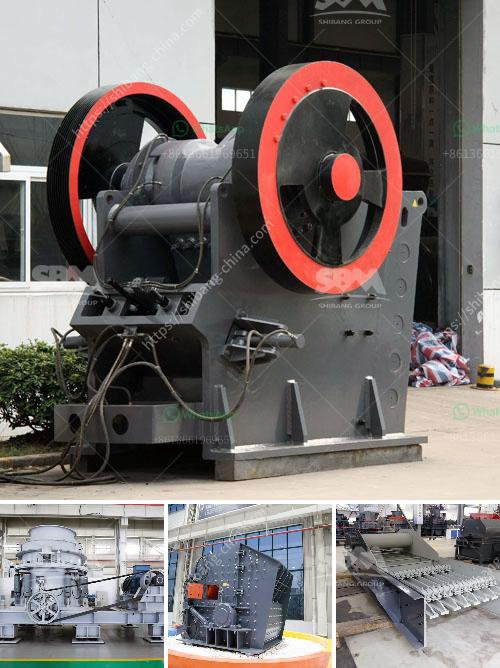

<h3>cement boll mill grinding</h3>
Cement is a vital component of construction projects worldwide, and boll mills are essential in grinding it down, preparing it for use in the construction industry. Cement boll mills are widely used in cement, silicate products, new building materials, refractory materials, fertilizers, black and non-ferrous metal dressings, and glass ceramics industries. They’re commonly used in the final grinding stage of cement production.

The cement manufacturing process begins with the extraction and preparation of the raw materials – mainly limestone and clay. These raw materials are crushed into smaller pieces with the help of crushers or boll mills. The crushed materials are then mixed and heated in a kiln to form clinker, which is the intermediate product.

Once the clinker is cooled, it is ground into a fine powder with the help of cement boll mills. The grinding process involves feeding the clinker into the mill, where it is reduced in size by impact and friction between grinding balls. The grinding balls are usually made of steel and act as the grinding media in the boll mill.

The boll mills consist of a horizontal cylindrical shell filled with the material to be ground, along with grinding media. The rotating drum causes the grinding media to tumble and crush the clinker into a fine powder. The particle size of the ground material is controlled by the size and number of grinding balls, the speed of the mill, and the duration of grinding.

There are two main types of cement boll mills: the open circuit and the closed circuit mill. The open circuit mill is used for the primary grinding stage, while the closed circuit mill is used for the secondary or final grinding stage. Both types of mills can have multiple compartments to separate different sizes of grinding media and control the particle size distribution of the final product.

In addition to grinding clinker, cement boll mills are also used to grind other materials such as limestone, fly ash, slag, and gypsum. They can grind either wet or dry, but most efficiently when operated in a wet grinding configuration. Wet grinding provides better dispersion of the materials and reduces the energy consumption during the grinding process.

The efficiency of cement boll mills can be improved by several factors. One of the crucial factors is the selection of the proper grinding media. The grinding media should be wear-resistant and have a sufficient hardness to crush the clinker efficiently. The shape and size of the grinding media also play a significant role in the grinding process.

Another factor that affects the efficiency of cement boll mills is the speed of the mill. Increasing the speed of the mill can increase the kinetic energy of the grinding media, resulting in better grinding efficiency. However, excessive speed can also lead to excessive wear on the mill liners, reducing the overall efficiency.

In conclusion, cement boll mills play a crucial role in the cement manufacturing process by grinding the clinker into a fine powder. This powder is then used as the main ingredient in cement production. The efficiency of the grinding process is influenced by various factors, including the selection of grinding media, the speed of the mill, and the particle size distribution of the final product. Improving the efficiency of cement boll mill grinding can result in significant cost savings and improved overall cement quality.
<h3>Contact us</h3><ul><li><strong>Whatsapp:&nbsp;<a href="https://wa.me/8613661969651">+8613661969651</a></strong></li><li><a href="https://swt.shibang-china.com/?git&amp;zhl&amp;cement boll mill grinding"><strong>Online Service(chat now)</strong></a></li></ul><h3>Related</h3><ul><li><a href='suppliers of chromite sand from south africa.md'>suppliers of chromite sand from south africa</a></li><li><a href='two roll mill supply in sri lanka.md'>two roll mill supply in sri lanka</a></li><li><a href='new ready mix crusher setup plan.md'>new ready mix crusher setup plan</a></li><li><a href='iron processing equipment in mexico.md'>iron processing equipment in mexico</a></li><li><a href='harga mesin pemecah batu kapasitas satu ton.md'>harga mesin pemecah batu kapasitas satu ton</a></li></ul>