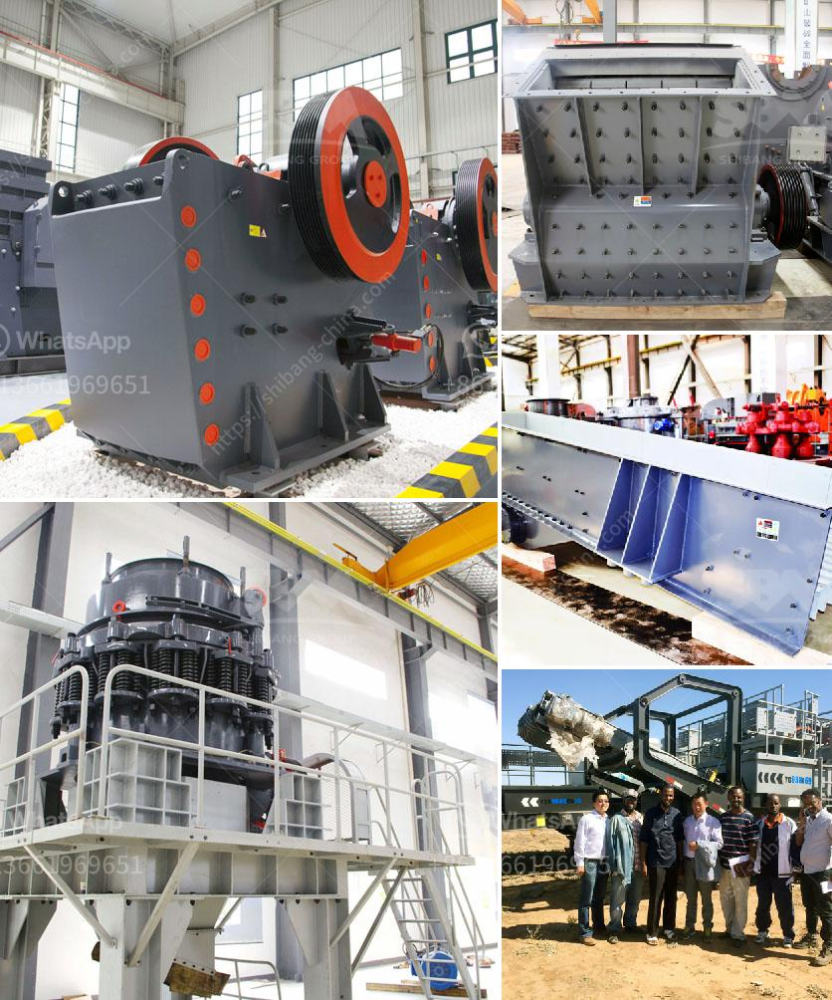

<h3>cement clinker crushing plant</h3>
Cement is a central ingredient in modern construction and has played a significant role in shaping infrastructure across the globe. Cement is usually produced by grinding a mixture of raw materials, including limestone, clay, shale, and iron ore, into a fine powder, called cement clinker. This clinker is then mixed with gypsum and other additives to produce cement.

To cater to the growing demand for cement, cement manufacturers are always on the lookout for efficient and reliable crushing equipment. Cement clinker crushing plants are perfectly suited for processing cement clinker since it plays a vital role as a binding agent in construction materials.

A cement clinker crushing plant combines various pieces of equipment to create the desired crushing and grinding process. It can be a combination of jaw crusher, impact crusher, cone crusher, and other grinding mill machines. These different crushing stages are mainly used for different purposes, such as the primary crushing, secondary crushing, and tertiary crushing of clinker.

The primary crusher, usually a jaw crusher, breaks down the raw material into manageable sizes. This initial crushing process reduces the raw material to a uniform size, making it easier to transport and store. The secondary crusher, such as an impact crusher, further reduces the size of the clinker, ensuring it meets the required specifications.

Once the clinker is crushed to the desired size, it is then mixed with gypsum and other additives in the grinding mill to produce cement. The grinding process involves reducing the clinker particles to a fine powder, which enhances the cement's properties and strength.

In recent years, there has been a shift towards more sustainable and eco-friendly cement production. Cement plants are increasingly adopting innovative technologies to reduce their environmental impact. Some cement clinker crushing plants incorporate state-of-the-art dust collection systems to minimize dust emissions during the crushing and grinding process. Additionally, these plants may also incorporate energy-efficient equipment to reduce electricity consumption.

Furthermore, cement manufacturers are exploring alternative materials to replace traditional clinker byproducts, which are responsible for a significant amount of carbon dioxide emissions. By utilizing industrial byproducts, such as fly ash or slag, in the cement production process, these plants aim to reduce their carbon footprint and contribute to a greener future.

In conclusion, cement clinker crushing plants play a crucial role in the cement manufacturing process. They provide the necessary equipment to extract, crush, and grind clinker into cement, ensuring the high quality and reliability of the final product. With ongoing advancements in technology, these plants are becoming more environmentally friendly and energy-efficient. As cement demand continues to grow, investing in efficient cement clinker crushing plants will boost industrial growth and contribute to sustainable construction practices.
<h3>Contact us</h3><ul><li><strong>Whatsapp:&nbsp;<a href="https://wa.me/8613661969651">+8613661969651</a></strong></li><li><a href="https://swt.shibang-china.com/?git&amp;zhl&amp;cement clinker crushing plant"><strong>Online Service(chat now)</strong></a></li></ul><h3>Related</h3><ul><li><a href='sand quarry plant.md'>sand quarry plant</a></li><li><a href='mining processing machine supplier companies in pakistan.md'>mining processing machine supplier companies in pakistan</a></li><li><a href='silica sand mines in maharashtra.md'>silica sand mines in maharashtra</a></li><li><a href='screen clay from limestone rock.md'>screen clay from limestone rock</a></li><li><a href='usine carbonate de calcium.md'>usine carbonate de calcium</a></li></ul>