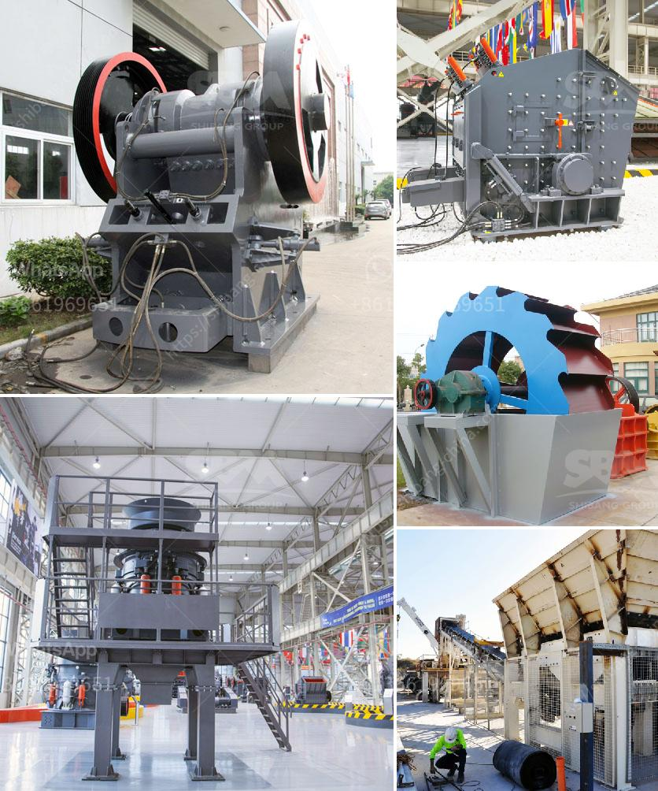

<h3>cement clinker powder line</h3>
Cement clinker powder line is an essential production process in cement manufacturing plants. It involves grinding the raw materials into a fine powder, called clinker, which is the main ingredient in cement. This process plays a crucial role in ensuring the quality and consistency of the final cement product.

The cement clinker powder line typically begins with the extraction of limestone and other raw materials from quarries or mines. These raw materials are then crushed and transported to the cement plant, where they are carefully proportioned to meet specific chemical and physical requirements.

The next step in the cement clinker powder line is the grinding of these raw materials. The raw materials are fed into a ball mill, a large rotating cylinder in which steel balls are used to pulverize the raw materials into a fine powder. This powder is known as raw meal.

The raw meal is then sent to a preheater tower, where it is heated to high temperatures to remove any moisture and volatile compounds. As the raw meal moves up the tower, it is preheated by the hot gases generated by the combustion of fuel. This preheating process is crucial to reduce the energy consumption during the final cement production.

After the preheating process, the raw meal enters the rotary kiln, the heart of the cement clinker powder line. In the kiln, the raw meal is subjected to intense heat, reaching temperatures of up to 1500 degrees Celsius. This heat causes the raw meal to undergo chemical reactions, resulting in the formation of clinker.

The clinker is then cooled and ground into a fine powder known as cement. This grinding process is usually carried out in a ball mill or vertical roller mill. The resulting cement powder is then stored in silos for further use in the production of concrete or other cement-based products.

The cement clinker powder line is highly automated, with sophisticated control systems ensuring precise control over the entire process. This automation helps to maintain consistent quality and optimize production efficiency. It also improves safety by minimizing the need for manual intervention in potentially hazardous areas.

In conclusion, the cement clinker powder line is a critical process in cement manufacturing plants. It involves grinding raw materials into a fine powder, known as clinker, which is the main ingredient in cement. This process requires careful control and optimization to ensure the production of high-quality cement. The automation of the process helps to maintain consistent quality and optimize production efficiency, leading to cost savings and improved safety.
<h3>Contact us</h3><ul><li><strong>Whatsapp:&nbsp;<a href="https://wa.me/8613661969651">+8613661969651</a></strong></li><li><a href="https://swt.shibang-china.com/?git&amp;zhl&amp;cement clinker powder line"><strong>Online Service(chat now)</strong></a></li></ul><h3>Related</h3><ul><li><a href='sand quarry plant.md'>sand quarry plant</a></li><li><a href='gold crusher philippines.md'>gold crusher philippines</a></li><li><a href='silica sand grinding.md'>silica sand grinding</a></li><li><a href='roller screen for coal.md'>roller screen for coal</a></li><li><a href='chain conveyors crushers.md'>chain conveyors crushers</a></li></ul>