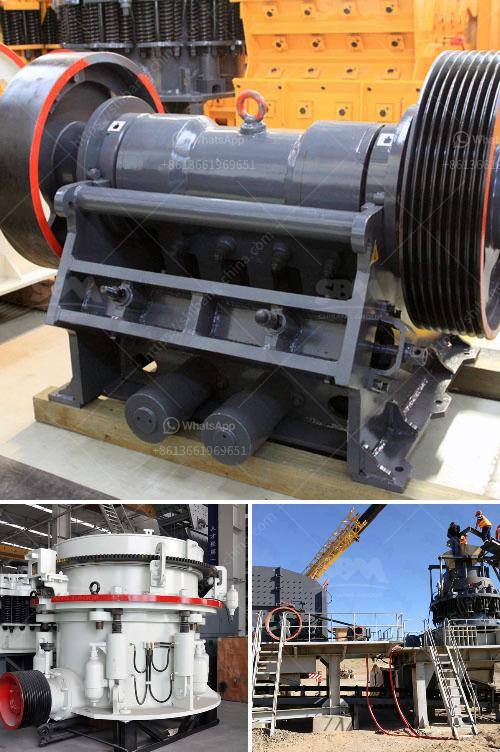

<h3>cement factory sale in tamilnadu</h3>
Tamil Nadu is a state known for its industrial prowess, and it is no surprise that the cement industry is a key player in the state's economic development. Over the years, cement factories have served as pillars for growth, providing employment opportunities and contributing to the state's overall prosperity. Recently, the sale of a cement factory in Tamil Nadu has garnered significant attention in the business community, signaling a positive shift in the industry dynamics.

The sale of a cement factory is not an ordinary business transaction; it is a reflection of market dynamics, industry trends, and the competitive landscape. Many factors may motivate a company to sell its cement factory, such as strategic realignment, divestment of non-core assets, or a focus on new ventures. In this case, the sale of the cement factory in Tamil Nadu opens up avenues for new entrants or existing players in the industry to expand their operations and make their mark.

One of the immediate benefits resulting from the sale of a cement factory is the creation of more job opportunities. Cement factories are labor-intensive, employing a large number of workers across various departments. With new owners taking charge, there will be a surge in recruitment, bringing employment opportunities to the local workforce and supporting the state's commitment to reduce unemployment rates.

Moreover, the sale of a cement factory can boost regional development. These factories require a significant amount of raw materials, such as limestone and clay, which are often sourced locally. With the acquisition of the factory, the new owners will likely increase their local sourcing, benefiting local mining industries and promoting regional economic growth.

Furthermore, the cement industry has a significant impact on infrastructure development. Cement is a crucial component in the construction of roads, bridges, buildings, and other infrastructure projects. With the sale of a cement factory, there is a higher chance of increased production, ensuring a steady supply of cement for infrastructure development in Tamil Nadu. This, in turn, will contribute to the state's infrastructure growth, attracting investments and fostering economic development.

As the cement factory changes hands, it is imperative for the new owners to focus on sustainability and environmental considerations. The cement industry is often associated with high energy consumption, emissions, and resource depletion. However, many cement manufacturers are increasingly adopting greener practices and investing in research and development to reduce their environmental impact. The new owners of the cement factory in Tamil Nadu should prioritize sustainable practices, including energy efficiency, waste management, and emission reduction, to ensure a positive environmental footprint.

In conclusion, the sale of a cement factory in Tamil Nadu is a significant development in the state's industrial landscape. This transaction not only opens new opportunities for growth and job creation but also contributes to the overall economic development of the region. The new owners must prioritize sustainability and environmental responsibility to ensure responsible growth and minimize the industry's impact on the environment. With these considerations in place, the cement industry in Tamil Nadu is poised to thrive, cementing its position as a key player in the state's industrial growth.
<h3>Contact us</h3><ul><li><strong>Whatsapp:&nbsp;<a href="https://wa.me/8613661969651">+8613661969651</a></strong></li><li><a href="https://swt.shibang-china.com/?git&amp;zhl&amp;cement factory sale in tamilnadu"><strong>Online Service(chat now)</strong></a></li></ul><h3>Related</h3><ul><li><a href='basalt mining crusher.md'>basalt mining crusher</a></li><li><a href='jaw crusher used india.md'>jaw crusher used india</a></li><li><a href='cement ball mill design pdf.md'>cement ball mill design pdf</a></li><li><a href='ball mill manufacturers in mumbai.md'>ball mill manufacturers in mumbai</a></li><li><a href='raymond mills india.md'>raymond mills india</a></li></ul>