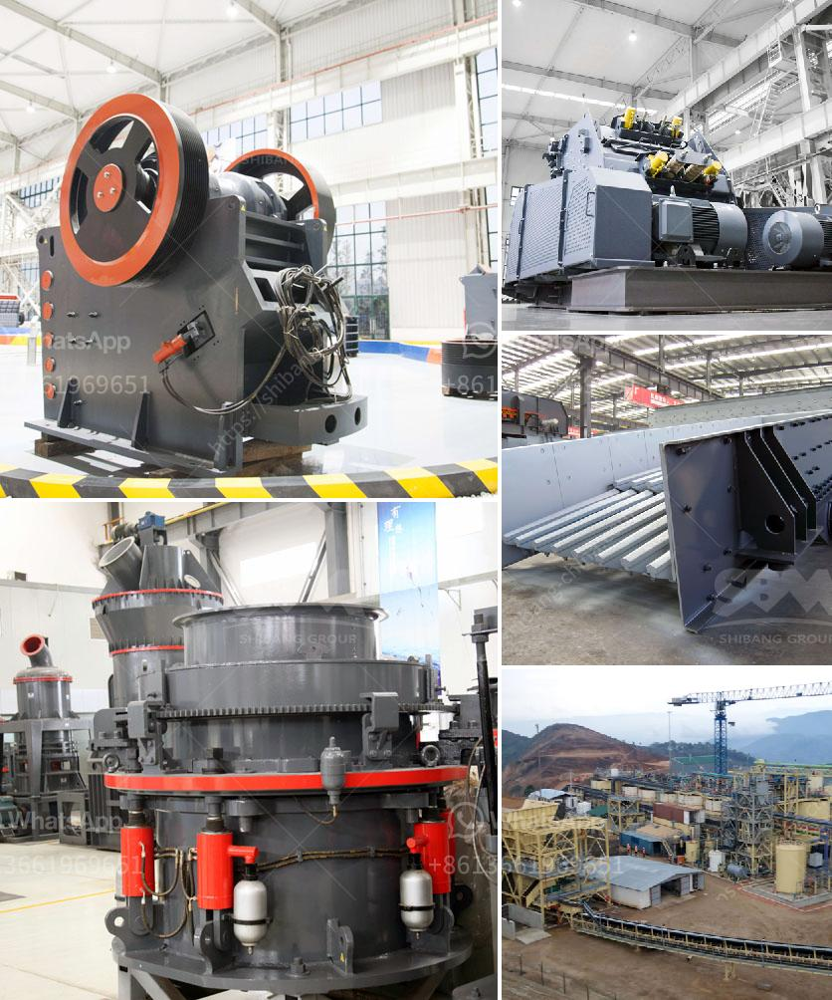

<h3>cement manufacturing process ppt</h3>
Cement manufacturing is a highly energy-intensive process. It requires the use of a variety of equipment and machinery, including crushers, kilns, mills, and coolers, to extract, transport, and process the raw materials such as limestone, clay, and shale. These raw materials are blended and finely ground to form the powdery substance known as cement.

The cement manufacturing process can be divided into five key steps: raw material preparation, clinkerization, cement grinding, storage, and packaging. Each of these steps requires intensive energy consumption and emits a considerable amount of carbon dioxide (CO2) – a greenhouse gas responsible for climate change.

The first step in the cement manufacturing process is raw material preparation. This involves the extraction of limestone and clay from the quarry, crushing and grinding of these materials, and their mixing in proper proportions to obtain a homogenous mixture. The homogenous mixture is then transported to the rotary kiln for further processing.

The second step is clinkerization, where the raw materials are subjected to high temperatures in the kiln. The rotary kiln is a large cylindrical vessel, inclined at an angle, that rotates slowly to ensure the proper mixing and heat exchange of the materials. At these high temperatures, the raw materials undergo a series of chemical reactions, forming clinker – small, marble-sized nodules that are grayish-black in color.

The third step is cement grinding. The clinker is cooled and ground into a fine powder with the addition of a small amount of gypsum to control the setting time. This finely ground cement is known as Portland cement and is the most common type of cement used in construction.

The fourth step is storage. After grinding, the cement is stored in silos, where it is kept until it is needed for packaging or further processing. Proper storage is essential to maintain the quality and properties of the cement.

The final step is packaging. The cement is packed in bags or bulk containers and transported to construction sites or distribution centers. During packaging, special attention is paid to ensure the proper labeling and handling of the cement to avoid any contamination or loss of quality.

The cement manufacturing process is not only energy-intensive but also environmentally challenging. The burning of fossil fuels in the kiln releases large amounts of CO2 emissions, contributing to global warming. Additionally, the quarrying of raw materials can result in the destruction of natural habitats and biodiversity.

To mitigate these environmental impacts, many cement manufacturers are adopting cleaner and more sustainable practices. Some of these practices include the use of alternative fuels, such as biomass or waste-derived fuels, to reduce fossil fuel consumption and lower CO2 emissions. Additionally, efforts are being made to optimize production processes and improve energy efficiency.

In conclusion, the cement manufacturing process is a complex and energy-intensive process that involves the extraction, grinding, and mixing of raw materials to produce cement. It is essential for cement manufacturers to adopt sustainable practices to reduce environmental impacts and contribute to a greener future.
<h3>Contact us</h3><ul><li><strong>Whatsapp:&nbsp;<a href="https://wa.me/8613661969651">+8613661969651</a></strong></li><li><a href="https://swt.shibang-china.com/?git&amp;zhl&amp;cement manufacturing process ppt"><strong>Online Service(chat now)</strong></a></li></ul><h3>Related</h3><ul><li><a href='crushing plant zenith.md'>crushing plant zenith</a></li><li><a href='how to make clay powder machine.md'>how to make clay powder machine</a></li><li><a href='ball mill education.md'>ball mill education</a></li><li><a href='crushing of concrete in pakistan.md'>crushing of concrete in pakistan</a></li><li><a href='crushing companies in the usa.md'>crushing companies in the usa</a></li></ul>