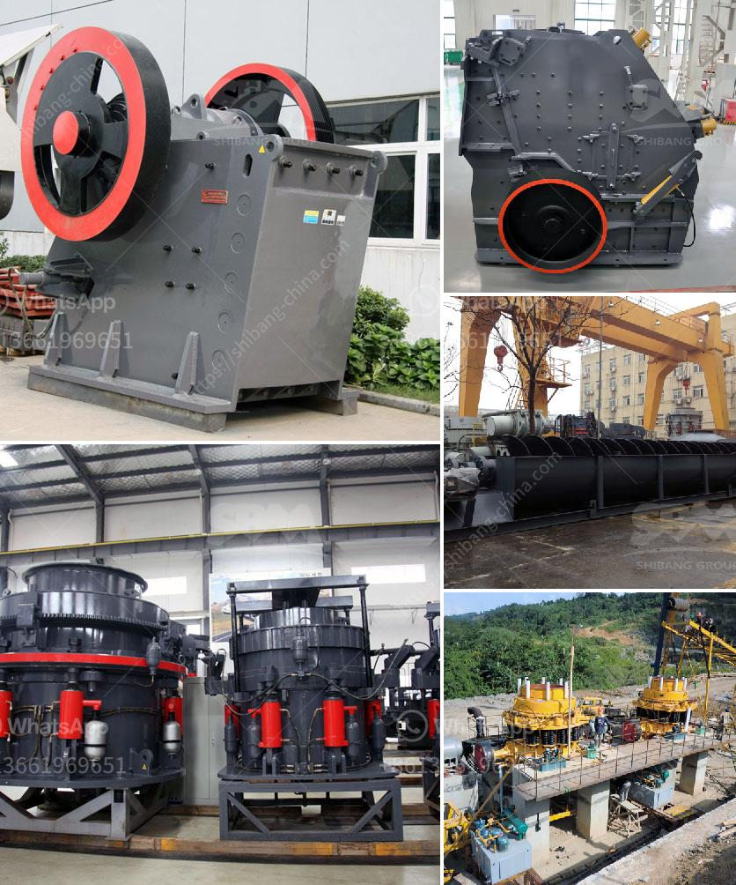

<h3>cement plant ataustralia</h3>
Australia's cement industry plays a vital role in the country's infrastructure development and economic growth. Cement plants across the nation act as the backbone of construction projects, providing essential materials to build roads, bridges, buildings, and various other infrastructure projects. This article sheds light on the significance of cement plants in Australia, highlighting their contribution to the nation's development.

Australia boasts a robust cement supply chain, from raw material extraction to manufacturing, distribution, and utilization. The cement production process involves extracting limestone, crushing it to powder form, then combining it with other minerals in kilns to create cement clinker. These clinkers are then finely ground to produce cement, which is transported to construction sites across the country.

As sustainability gains prominence, Australian cement plants have also embraced environmentally friendly practices. Several cement manufacturers are adopting alternative fuels such as biomass, used tires, or waste generated from other industries, reducing their carbon footprint. Moreover, innovative production techniques minimize pollution and energy consumption, demonstrating the industry's commitment to sustainable development.

Cement plants are strategically located across Australia to ensure a steady supply of cement to various regions. Coastal cement plants often have easy access to shipping, facilitating the transport of cement to remote and urban areas alike. The efficient distribution network ensures that infrastructure development is not hindered due to logistical challenges.

The cement industry in Australia is a significant employer, providing jobs for thousands of individuals. From skilled technicians and engineers to laborers and support staff, cement plants offer a wide array of employment opportunities, contributing to the country's economic growth and prosperity.

Australia's cement plants are indispensable in driving the nation's infrastructure development. By producing cement, these plants enable the construction of vital projects, ensuring the growth and progress of communities across the country. Moreover, their commitment to environmental sustainability and employment creation further enhances their value. As Australia continues to advance, cement plants will remain an integral part of the nation's infrastructure and economic prosperity.
<h3>Contact us</h3><ul><li><strong>Whatsapp:&nbsp;<a href="https://wa.me/8613661969651">+8613661969651</a></strong></li><li><a href="https://swt.shibang-china.com/?git&amp;zhl&amp;cement plant ataustralia"><strong>Online Service(chat now)</strong></a></li></ul><h3>Related</h3><ul><li><a href='silica sand washing.md'>silica sand washing</a></li><li><a href='vertical roller mill price.md'>vertical roller mill price</a></li><li><a href='graphite crusher products.md'>graphite crusher products</a></li><li><a href='two roll mill supply in sri lanka.md'>two roll mill supply in sri lanka</a></li><li><a href='mining hammer crusher.md'>mining hammer crusher</a></li></ul>