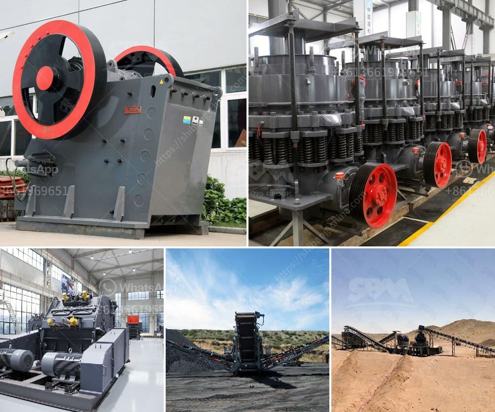

<h3>cement plant for sale in india 200 tpd</h3>
India, the second-largest producer of cement in the world, is experiencing a significant boom in the construction industry. As the country continues to expand its infrastructure, the demand for cement is steadily increasing. This presents a lucrative opportunity for investors looking to capitalize on the booming cement industry by acquiring a cement plant for sale in India.

One such plant that is currently available for sale in India is a 200 TPD cement plant. It promises to be a cost-effective investment and a unique opportunity for ambitious entrepreneurs looking to step into the cement manufacturing business.

The plant is situated in an industrial area in Jamshedpur, Jharkhand, with easy accessibility to transportation and logistics. This enhances the plant's potential for serving not only local demand but also for catering to neighboring states and regions. The location ensures a strategic advantage in terms of sourcing raw materials and distributing the finished product.

The cement plant for sale boasts a production capacity of 200 TPD (tons per day) and is spread across 8 acres of land. The primary machinery of the plant includes crushers, conveyors, cement mills, and packing machines, ensuring a seamless production process. Additionally, the plant is equipped with a laboratory for quality control and testing purposes, ensuring consistently high-quality cement.

Moreover, the plant has obtained all the necessary licenses and permits, making it a hassle-free investment option for potential buyers. The plant complies with all applicable environmental and safety regulations, offering a sustainable and socially responsible business endeavor.

Buying a cement plant in India not only provides a solid investment opportunity but also contributes to the country's economic growth. The cement industry plays a vital role in India's infrastructure development and is a key driver of employment generation. By acquiring this plant, investors have the chance to become a part of this growth story and contribute to the nation's progress.

Furthermore, the plant's production capacity of 200 TPD allows for scalability and expansion. With increasing demand, there is an opportunity to expand the plant's capacity, thus further enhancing the return on investment. This flexibility adapts to the ever-evolving market dynamics and amplifies the growth potential of the venture.

Investing in a cement plant in India also offers various tax benefits and incentives provided by the government. This further enhances the financial viability and attractiveness of the opportunity. Additionally, with India's focus on promoting manufacturing and self-reliance, the cement industry is expected to receive continued support from the government, ensuring a favorable business environment.

In conclusion, the opportunity to acquire a cement plant for sale in India with a production capacity of 200 TPD is a promising investment prospect. With the country's increasing infrastructure development and the cement industry's booming demand, the potential for long-term profitability is substantial. This investment not only offers financial returns but also contributes to India's growth and economic development. Aspiring entrepreneurs should consider this opportunity and capitalize on the cement industry's promising prospects in the country.
<h3>Contact us</h3><ul><li><strong>Whatsapp:&nbsp;<a href="https://wa.me/8613661969651">+8613661969651</a></strong></li><li><a href="https://swt.shibang-china.com/?git&amp;zhl&amp;cement plant for sale in india 200 tpd"><strong>Online Service(chat now)</strong></a></li></ul><h3>Related</h3><ul><li><a href='raymond grinding mill machine.md'>raymond grinding mill machine</a></li><li><a href='calcium ball mill.md'>calcium ball mill</a></li><li><a href='stone crusher pfs price.md'>stone crusher pfs price</a></li><li><a href='stone crusher second hand south africa.md'>stone crusher second hand south africa</a></li><li><a href='gyratory crusher harga.md'>gyratory crusher harga</a></li></ul>