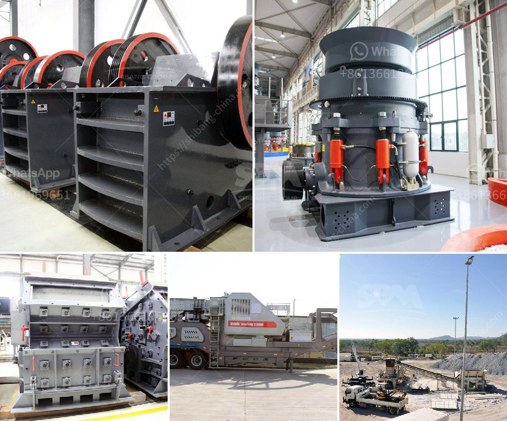

<h3>cement plant grinding unit</h3>
Cement plants are industrial facilities that are used to process raw materials into cement. They play a vital role in the construction industry as they are responsible for producing the key ingredient for concrete, which is used to build various structures such as roads, bridges, and buildings. Within these cement plants, there are different units, one of them being the grinding unit.

A cement plant grinding unit is a standalone unit of a cement industry and is used to grind clinker, gypsum, and other additives for making cement. The dry grinding process is usually used for making cement, but plants can also use wet grinding if the materials are particularly difficult to handle or if the grinding efficiency is low.

The grinding unit consists of a mill housing, grinding media, and a motor. The mills are usually divided into two or three chambers, with different size grinding media. As the clinker and other additives pass through the chambers, they are ground into fine particles of cement. The grinding media, usually in the form of balls or cylpebs, are responsible for the grinding action. These balls or cylpebs collide and crush the materials, thereby reducing them to the desired fineness.

The grinding unit plays a crucial role in achieving the desired strength and quality of cement. It not only reduces the particles to the required size but also ensures that the cement has a consistent particle size distribution. This is important as it affects the setting time, strength development, and durability of the final product. The grinding unit must also ensure that the cement does not become too fine, as this would lead to reduced strength and increased water demand.

To ensure optimal performance of the grinding unit, regular maintenance and monitoring are essential. The mill internals, including the liners and grinding media, need to be inspected and replaced periodically to maintain the grinding efficiency. The motor and other mechanical components should also be checked for any signs of wear or malfunction.

In addition to maintaining the grinding unit, cement plants need to ensure that the quality of the raw materials is consistent. Any variations in the composition or quality of the raw materials can affect the grinding process and, consequently, the quality of the cement. Therefore, regular testing and analysis of the raw materials are necessary to ensure that they meet the required specifications.

Overall, cement plant grinding units are critical components in the cement production process. They are responsible for grinding the raw materials into the required fineness and ensuring that the cement has a consistent particle size distribution. By maintaining the grinding unit and monitoring the quality of the raw materials, cement plants can produce high-quality cement that meets the standards and requirements of the construction industry.
<h3>Contact us</h3><ul><li><strong>Whatsapp:&nbsp;<a href="https://wa.me/8613661969651">+8613661969651</a></strong></li><li><a href="https://swt.shibang-china.com/?git&amp;zhl&amp;cement plant grinding unit"><strong>Online Service(chat now)</strong></a></li></ul><h3>Related</h3><ul><li><a href='river pebble crusher supplier.md'>river pebble crusher supplier</a></li><li><a href='coal crusher buyer in philippines.md'>coal crusher buyer in philippines</a></li><li><a href='crusher stone crusher 4 ton.md'>crusher stone crusher 4 ton</a></li><li><a href='quartz manufacturing process.md'>quartz manufacturing process</a></li><li><a href='graphite powder making machine.md'>graphite powder making machine</a></li></ul>