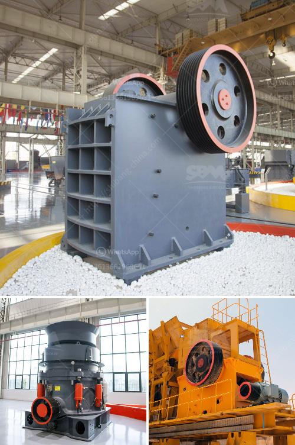

<h3>cement plant machinery list</h3>
Cement is a crucial material used in construction projects, and the production process relies on highly efficient machinery. A cement plant consists of various types of machinery that facilitate the production of cement and ensure its quality. In this article, we will provide a comprehensive list of machinery commonly found in cement plants.

1. Crushers: Crushers are essential equipment used in cement production. They break down large limestone rocks into smaller sizes to facilitate further processing. Various types of crushers, including jaw crushers, impact crushers, and hammer crushers, are commonly used.

2. Raw Mill: The raw mill is responsible for grinding raw materials such as limestone and clay into a fine powder, which is then used for making cement. This process requires a high-quality grinding mill capable of handling wet, dry, and semi-dry materials.

3. Kiln: The cement kiln is the heart of the cement production process. It is a large rotating kiln in which the raw materials are heated at high temperatures to convert them into clinker. The kiln plays a significant role in the final quality of the cement.

4. Cement Mill: After the clinker is cooled, it is ground into a fine powder in a cement mill. The cement mill is responsible for grinding cement clinker, gypsum, and other additives into the desired particle size. This process is essential for producing high-quality cement.

5. Silos: Silos are used for storing the raw materials and intermediate products at various stages of the cement manufacturing process. They help maintain a consistent supply of materials and enable efficient production.

6. Packaging Machine: Once the cement is ready, it needs to be packaged for transportation and sale. A packaging machine is used to fill cement bags or load cement into bulk trucks. This equipment ensures accurate measurement and speed in the packaging process.

7. Conveyors: Conveyors are widely used in cement plants to transport materials from one process to another. They can be used to transport raw materials, clinker, and finished cement. Efficient conveyor systems greatly enhance the overall efficiency of a cement plant.

8. Dust Collectors: Cement production generates a significant amount of dust, which can be harmful to workers and the environment. Dust collectors are used to capture and filter the dust particles generated during various processes. They help maintain a clean and safe working environment.

9. Storage Tanks: Cement plants require storage tanks for storing various liquids, including fuels, raw materials, and water. These tanks ensure a constant supply of critical resources and facilitate uninterrupted production.

10. Compressors: Compressed air is extensively used in cement plants for various applications like operating pneumatic valves, cleaning equipment, and powering pneumatic tools. Compressors provide a reliable and efficient source of compressed air necessary for these operations.

In conclusion, a cement plant relies on a wide range of machinery to produce high-quality cement efficiently. The list mentioned above highlights the crucial machinery found in almost all cement plants. Each piece of equipment contributes to a specific step in the cement manufacturing process, ensuring the production of reliable and durable cement for construction projects.
<h3>Contact us</h3><ul><li><strong>Whatsapp:&nbsp;<a href="https://wa.me/8613661969651">+8613661969651</a></strong></li><li><a href="https://swt.shibang-china.com/?git&amp;zhl&amp;cement plant machinery list"><strong>Online Service(chat now)</strong></a></li></ul><h3>Related</h3><ul><li><a href='lippman jaw crusher for sale.md'>lippman jaw crusher for sale</a></li><li><a href='jaw impact crusher poland.md'>jaw impact crusher poland</a></li><li><a href='cement plant machinery manufacturers in germany.md'>cement plant machinery manufacturers in germany</a></li><li><a href='crusher stone crusher 4 ton.md'>crusher stone crusher 4 ton</a></li><li><a href='price of stone crusher plant.md'>price of stone crusher plant</a></li></ul>