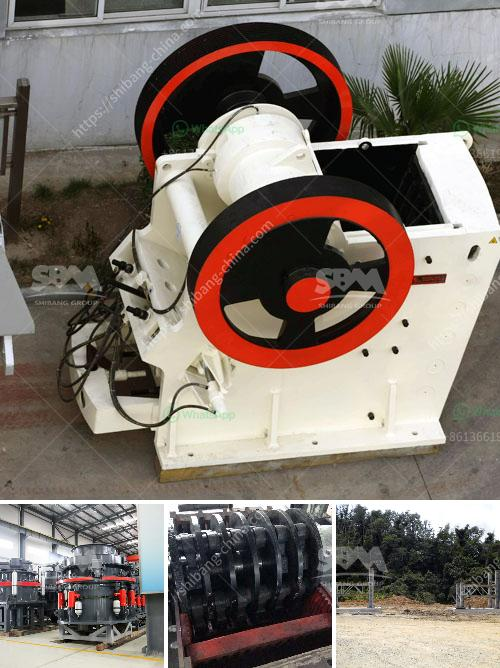

<h3>cement plant machinery manufacturers in germany</h3>
Germany has long been known for its engineering prowess and manufacturing excellence, and the cement plant machinery industry is no exception. With its cutting-edge technology and innovative solutions, Germany has become a global leader in the cement plant machinery sector.

One of the key players in this industry is Germany, renowned for its reliable and high-quality cement plant machinery manufacturers. These companies specialize in producing state-of-the-art machines and equipment used in the cement production process.

German machinery manufacturers offer a wide range of products that cater to every need of cement plant operators. They provide machinery and equipment for various stages of cement production, including crushers, kilns, clinker coolers, and grinding mills. These machines are designed with precision and efficiency in mind, ensuring optimal performance and cost-effectiveness for cement plant operators.

Germany's cement plant machinery manufacturers prioritize sustainability in their production processes. They strive to develop environmentally friendly solutions that not only reduce carbon emissions but also enhance energy efficiency. This commitment to sustainability aligns with Germany's broader vision to transition towards a greener and more sustainable future.

In addition to their focus on sustainability, German cement plant machinery manufacturers also prioritize innovation. They constantly invest in research and development to improve their products and introduce new technologies that enhance the efficiency and performance of cement plants. These advancements have helped cement plant operators increase productivity and reduce operational costs.

Moreover, Germany's cement plant machinery manufacturers are known for their excellent customer service and after-sales support. They provide comprehensive training, installation, and maintenance services to ensure that their customers can operate their machinery optimally and maximize their investment.

With their advanced technology, commitment to sustainability, and dedication to innovation, German cement plant machinery manufacturers have become the go-to choice for cement plant operators worldwide. Their machinery and equipment not only enhance the efficiency and performance of cement plants but also contribute to a greener and more sustainable cement production process.
<h3>Contact us</h3><ul><li><strong>Whatsapp:&nbsp;<a href="https://wa.me/8613661969651">+8613661969651</a></strong></li><li><a href="https://swt.shibang-china.com/?git&amp;zhl&amp;cement plant machinery manufacturers in germany"><strong>Online Service(chat now)</strong></a></li></ul><h3>Related</h3><ul><li><a href='coal crusher 6mm.md'>coal crusher 6mm</a></li><li><a href='hammer mill design plans pdf mtm crusher.md'>hammer mill design plans pdf mtm crusher</a></li><li><a href='mineral plant bauxite ore crushing plant.md'>mineral plant bauxite ore crushing plant</a></li><li><a href='list of mini cement plants in gujarat.md'>list of mini cement plants in gujarat</a></li><li><a href='ball mill hammer mill.md'>ball mill hammer mill</a></li></ul>