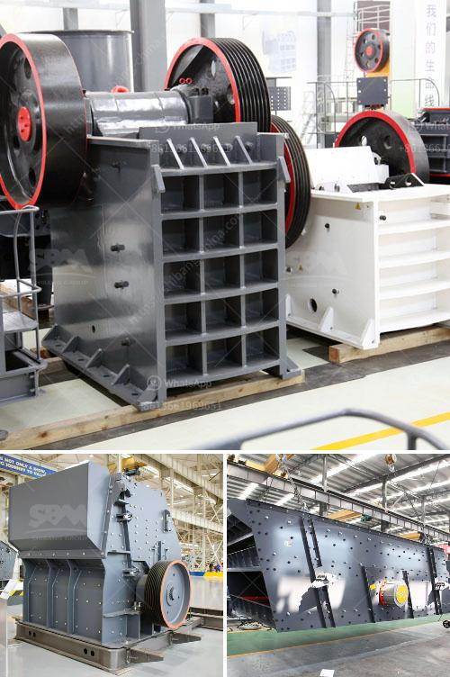

<h3>cement plant machinery supplier in korea</h3>
Korea has been a leader in industrial development and has achieved remarkable progress in various sectors. One such industry that has played a crucial role in Korea's infrastructural growth is the cement industry. Cement plants require top-quality machinery and equipment to produce cement efficiently and effectively. This is where cement plant machinery suppliers in Korea have made a significant contribution.

Cement plant machinery suppliers in Korea offer a wide range of cutting-edge equipment that is designed to ensure high productivity and reduce energy consumption. These suppliers partner with cement manufacturers to provide them with the latest technology and innovative solutions, enabling them to produce high-quality cement at a competitive cost.

The suppliers offer a comprehensive range of cement plant machinery, including crushers, kilns, mills, and packing machines. These machines are designed to handle different stages of the cement manufacturing process, ensuring a smooth and seamless operation from raw material extraction to the final product.

Korean cement plant machinery suppliers specialize in providing customized solutions to meet the specific requirements of cement manufacturers. They work closely with their customers to understand their needs and then design and manufacture machinery accordingly. This personalized approach ensures that the equipment is tailored to the unique specifications of each cement plant, resulting in maximum efficiency and productivity.

One of the primary focuses of cement plant machinery suppliers in Korea is on sustainability and eco-friendliness. They strive to develop cutting-edge technologies and machinery that minimize environmental impact while optimizing energy efficiency. This commitment to sustainable manufacturing practices helps cement manufacturers reduce their carbon footprint and meet environmental regulations.

In addition to offering top-quality machinery, Korean suppliers also provide excellent after-sales services, including installation, maintenance, and repair. This ensures that the equipment operates at its peak performance and reduces any downtime or interruptions in the production process.

Korea's cement plant machinery suppliers have gained a strong reputation for their reliability, professionalism, and dedication to customer satisfaction. They have emerged as trusted partners for cement manufacturers, supporting their growth and success in a competitive industry.

Moreover, Korean suppliers have expanded their reach to the global market. They export their machinery and equipment to cement manufacturers worldwide, further establishing themselves as leading suppliers in the international cement industry. Their reputation for high-quality products has made them sought-after partners for manufacturers looking to enhance their cement production capabilities.

In conclusion, cement plant machinery suppliers in Korea have played a crucial role in the growth and success of the cement industry. They offer a wide range of cutting-edge machinery and equipment that ensures high productivity, energy efficiency, and sustainability. Their commitment to customer satisfaction and personalized solutions has made them trusted partners for cement manufacturers not only in Korea but also globally. Korean suppliers continue to innovate and push the boundaries of technology, driving the cement industry forward and contributing to the development of infrastructure worldwide.
<h3>Contact us</h3><ul><li><strong>Whatsapp:&nbsp;<a href="https://wa.me/8613661969651">+8613661969651</a></strong></li><li><a href="https://swt.shibang-china.com/?git&amp;zhl&amp;cement plant machinery supplier in korea"><strong>Online Service(chat now)</strong></a></li></ul><h3>Related</h3><ul><li><a href='estimated cost for cement grinding mill.md'>estimated cost for cement grinding mill</a></li><li><a href='difference between hp cone crusher.md'>difference between hp cone crusher</a></li><li><a href='raymond mill manufacturers in india.md'>raymond mill manufacturers in india</a></li><li><a href='pakistan silica sand washing plant.md'>pakistan silica sand washing plant</a></li><li><a href='grinding mill machine cost price south africa.md'>grinding mill machine cost price south africa</a></li></ul>