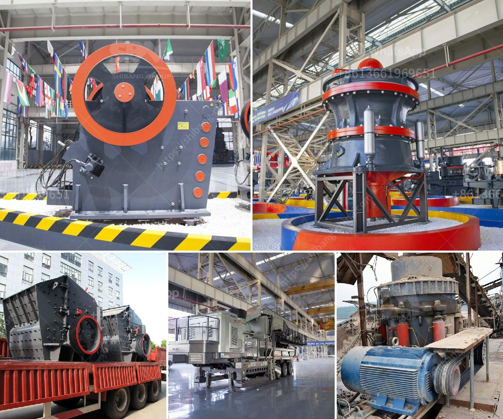

<h3>cement plant operations handbook</h3>
The Cement Plant Operations Handbook is a comprehensive guide to the efficient operation of cement plants. Written by Master Builders Solutions experts, it provides tools, strategies, and best practices for the successful operation of a cement manufacturing facility.

The handbook covers all aspects of cement production, including the raw materials, handling and storage, pyroprocessing, clinker cooling, grinding, and dispatch. It provides detailed information on each stage of the process, highlighting potential issues and offering practical solutions to optimize the plant’s performance.

One of the key focuses of the handbook is on energy efficiency and environmental impact. It provides insights into energy-saving techniques, waste management, and emissions reduction. With the growing demand for sustainable practices in the cement industry, this information is invaluable for plant operators looking to minimize their environmental footprint.

Furthermore, the Cement Plant Operations Handbook highlights the importance of safety and asset management. It contains guidelines to ensure the well-being of employees and the protection of plant equipment. The handbook also includes tips for maintaining high-quality standards in cement production, ensuring that the end product meets the required specifications.

Overall, the Cement Plant Operations Handbook is an essential resource for cement plant operators, engineers, and technicians. It provides a detailed roadmap to optimize plant efficiency, reduce costs, and minimize environmental impact. With its practical advice and expert insights, this handbook helps cement producers stay competitive in the ever-changing global market. Implementing the knowledge shared in this handbook can lead to improved productivity, increased profitability, and a greener future for the cement industry.
<h3>Contact us</h3><ul><li><strong>Whatsapp:&nbsp;<a href="https://wa.me/8613661969651">+8613661969651</a></strong></li><li><a href="https://swt.shibang-china.com/?git&amp;zhl&amp;cement plant operations handbook"><strong>Online Service(chat now)</strong></a></li></ul><h3>Related</h3><ul><li><a href='clinker crsher plant for sale.md'>clinker crsher plant for sale</a></li><li><a href='price ball mill 40tph.md'>price ball mill 40tph</a></li><li><a href='stone crusher kapasitas 300 400 ton jam.md'>stone crusher kapasitas 300 400 ton jam</a></li><li><a href='china vertical roller mill prices.md'>china vertical roller mill prices</a></li><li><a href='price of stone crusher in philippines.md'>price of stone crusher in philippines</a></li></ul>