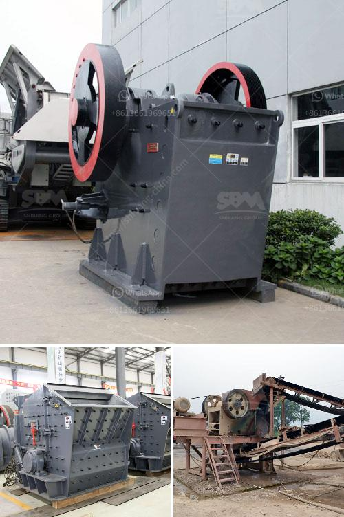

<h3>cement plant process flow diagram ppt</h3>
Cement is a basic material used in the construction industry. It is a fine powder that works as a binder, providing strength and durability to the structural elements. Cement production involves several steps, starting with the extraction of raw materials and ending with the packaging of the final product.

The process begins with the extraction of limestone and clay from quarries. These materials are crushed and transported to a cement plant where they undergo a blending process to produce a homogeneous mix. This mix is then heated in a kiln at high temperatures, around 1450 degrees Celsius, to form a substance called clinker.

The clinker is cooled and ground into a fine powder known as cement. This powder is mixed with gypsum, a small amount of other additives like limestone and fly ash, and water to form the final product. The mixture is then processed in a cement mill, where it is ground into a fine powder.

After the grinding process, the cement is stored in silos or transported in bulk to be packaged. The packaging involves filling cement bags with a specific amount of the product, usually 50kg per bag. These bags are then stacked on pallets and wrapped for transportation.

The cement plant process flow diagram encompasses all the necessary steps required in the production of cement. The diagram illustrates the steps and components involved in the manufacturing process, showcasing each individual stage in a detailed manner.

This process flow diagram provides a clear overview of the main elements involved in the production of cement, emphasizing the importance of each step. It serves as a useful tool for plant operators and management to understand and optimize the production process, ensuring efficiency and quality control.

In conclusion, the cement plant process flow diagram is an essential tool in the production of cement. It enables plant operators to accurately understand and optimize the entire process, ensuring the production of high-quality cement. By following this comprehensive diagram, cement plants can enhance their productivity and minimize any potential issues or bottlenecks in the production line.
<h3>Contact us</h3><ul><li><strong>Whatsapp:&nbsp;<a href="https://wa.me/8613661969651">+8613661969651</a></strong></li><li><a href="https://swt.shibang-china.com/?git&amp;zhl&amp;cement plant process flow diagram ppt"><strong>Online Service(chat now)</strong></a></li></ul><h3>Related</h3><ul><li><a href='silica sand manufacturing process.md'>silica sand manufacturing process</a></li><li><a href='price of crusher.md'>price of crusher</a></li><li><a href='quarry business plan.md'>quarry business plan</a></li><li><a href='graphite beneficiation process.md'>graphite beneficiation process</a></li><li><a href='gypsum plant equipment catalogue.md'>gypsum plant equipment catalogue</a></li></ul>