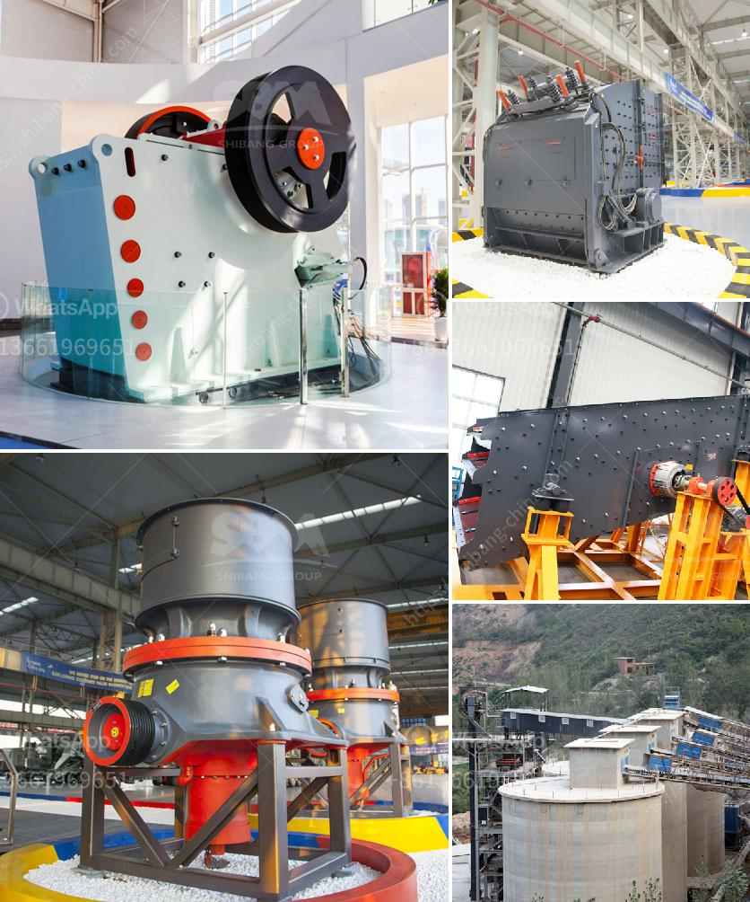

<h3>cement process making in philippines</h3>
The cement manufacturing process is a highly energy-intensive process with many unpredictable variables. To produce cement, a combination of limestone, shale, and other materials undergoes a complex series of chemical reactions. These reactions result in the formation of the essential ingredient, clinker, which is then ground into a fine powder to produce the final product, cement.

In the Philippines, cement production is a vital industry contributing to the country's development and infrastructure growth. The main cement producers in the Philippines are Holcim, Republic Cement, and Cemex. These companies operate several cement plants across the country, using both dry and wet processes.

The dry process involves crushing limestone and shale, which are then mixed in the correct proportions and fed into a rotary kiln. This kiln is heated to extremely high temperatures, around 1450 degrees Celsius, causing the raw materials to fuse together and form small marble-sized rocks known as clinker. After cooling, the clinker is ground into a fine powder and mixed with gypsum to produce the final cement product.

The wet process, on the other hand, involves a slurry of the raw materials being fed into a rotating kiln. The kiln is quite similar to that used in the dry process, but instead of heating the raw materials directly, steam is injected into the kiln. The steam reacts with the raw materials, causing them to harden and form clinker. Following cooling, the clinker is ground into cement.

The cement manufacturing process in the Philippines is subject to strict environmental regulations to minimize pollution, ensure proper waste disposal, and conserve resources. Companies must comply with guidelines set by the Department of Environment and Natural Resources (DENR) for emissions, water usage, and waste management.

The cement industry in the Philippines plays a crucial role in the country's infrastructure development, providing quality cement for various construction projects. With strict adherence to environmental standards, the sector continues to contribute to sustainable growth while ensuring the efficient production of high-quality cement.
<h3>Contact us</h3><ul><li><strong>Whatsapp:&nbsp;<a href="https://wa.me/8613661969651">+8613661969651</a></strong></li><li><a href="https://swt.shibang-china.com/?git&amp;zhl&amp;cement process making in philippines"><strong>Online Service(chat now)</strong></a></li></ul><h3>Related</h3><ul><li><a href='list of gold refineries companies in uae.md'>list of gold refineries companies in uae</a></li><li><a href='high energy ball mill price.md'>high energy ball mill price</a></li><li><a href='companies that manufacture ball mill.md'>companies that manufacture ball mill</a></li><li><a href='grinding mill machine cost price south africa.md'>grinding mill machine cost price south africa</a></li><li><a href='types of grinding mill.md'>types of grinding mill</a></li></ul>