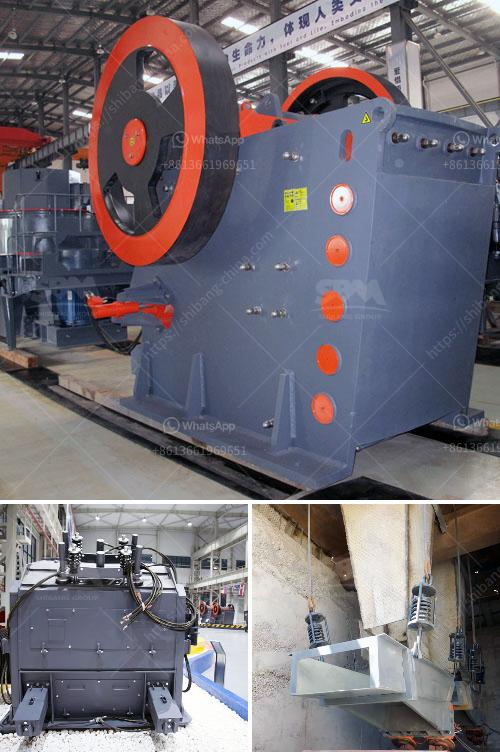

<h3>cercetare ball mill in rimania</h3>
The ball mill is a key piece of equipment for grinding crushed materials and is widely used in production lines for powders such as cement, silicates, refractory material, fertilizer, glass ceramics, etc., as well as for ore dressing of ferrous and non-ferrous metals. Romania is one of the leading countries in Europe for ball mill research and development.

In recent years, Romanian scientists and engineers have made significant advancements in the field of ball mill technology, leading to a greater understanding of its mechanisms and potential applications. Several research institutions and universities in Romania have dedicated research centers and laboratories for studying ball mills, enabling them to undertake advanced studies and experiments.

One area of interest in Romanian ball mill research is the optimization of grinding processes. By analyzing the variables involved in the grinding process, such as speed, ball size, and material properties, researchers are able to improve the efficiency and performance of ball mills, leading to cost savings and enhanced productivity for industries that utilize this equipment.

Furthermore, Romanian researchers are also exploring the use of ball mills in various industries beyond mining and mineral processing. For example, ball mills have been utilized in the pharmaceutical industry to produce powders with controlled particle sizes for drug delivery systems. By fine-tuning the grinding parameters, researchers have been able to create powders with specific properties, facilitating the development of novel drug formulations.

In addition to improving the performance and expanding the applications of ball mills, Romanian researchers are also investigating environmentally friendly alternatives for grinding media. Traditionally, steel balls have been used as grinding media; however, they can cause excessive wear on the mill, resulting in increased maintenance and costs. Romanian scientists are exploring the use of ceramic balls, which have a longer lifespan and are more resistant to wear.

Overall, as Romanian researchers continue to delve into the intricacies of ball mill technology, their efforts have the potential to revolutionize the industry. Through optimized grinding processes, expanded applications, and the development of alternative grinding media, ball mills can become even more efficient, environmentally friendly, and versatile tools in various fields.
<h3>Contact us</h3><ul><li><strong>Whatsapp:&nbsp;<a href="https://wa.me/8613661969651">+8613661969651</a></strong></li><li><a href="https://swt.shibang-china.com/?git&amp;zhl&amp;cercetare ball mill in rimania"><strong>Online Service(chat now)</strong></a></li></ul><h3>Related</h3><ul><li><a href='stone crusher cement factories in africa.md'>stone crusher cement factories in africa</a></li><li><a href='raymod 5 roller mill for pulverizing unit.md'>raymod 5 roller mill for pulverizing unit</a></li><li><a href='crusher dust washing machines.md'>crusher dust washing machines</a></li><li><a href='quartz stone crushing unit in india.md'>quartz stone crushing unit in india</a></li><li><a href='stone dust making machine.md'>stone dust making machine</a></li></ul>