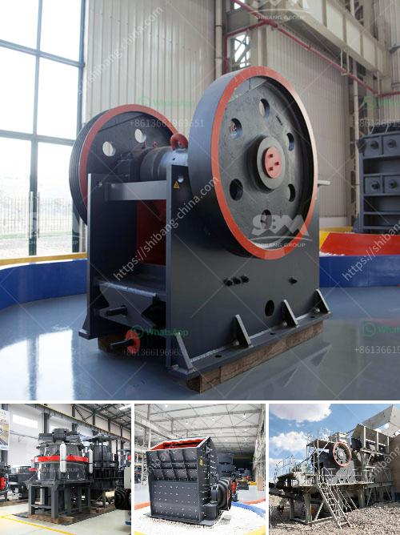

<h3>chain conveyors crushers</h3>
Chain conveyors crushers are heavy-duty machines that perform two main functions in the material handling process. Firstly, they transport material along a conveyor system. Secondly, they reduce the size of the material through crushing. Both of these functions are crucial in various industries such as mining, construction, and recycling.

The chain conveyor component of this machine is designed to move heavy or bulky items efficiently. It includes a chain belt that continuously circulates, carrying the material from one end to the other. The chain itself is composed of sturdy metal links that are interconnected to create a robust and reliable system. The speed at which the chain moves can be adjusted to suit different purposes and ensure optimal performance.

The primary purpose of chain conveyors crushers is to transport material from one location to another. This can be incredibly useful in industries where the material needs to be moved over long distances and across different areas of a facility. The chain conveyor system can be set up to form a loop or a straight line, depending on the layout of the facility and the specific requirements of the operation.

In addition to transportation, chain conveyors crushers also have the capability to reduce the size of the material they handle. This is achieved through the use of crushing mechanisms, which apply force and pressure to break down the material into smaller pieces. The crushed material can then be used for further processing or as a final product.

The crushing process in chain conveyors crushers is often accomplished with the use of heavy-duty jaws or rotating blades. These mechanisms are designed to exert enough force to break down even the toughest materials like rocks, concrete, or metal. The size of the crushed material can be adjusted based on the setting of the jaws or blades, allowing for versatility in the final product.

One of the significant advantages of chain conveyors crushers is their ability to handle various types of materials. From hard minerals to soft aggregates, these machines can efficiently transport and crush them all. This versatility makes them suitable for a wide range of industries as they can handle different materials simultaneously, saving time and increasing productivity.

When it comes to maintenance, chain conveyors crushers are built to withstand heavy use. The sturdy construction and durable components ensure longevity even under harsh operating conditions. Regular inspections and routine maintenance are necessary to keep the equipment running smoothly and prevent any potential issues.

In conclusion, chain conveyors crushers play a vital role in material handling and processing operations. They efficiently transport heavy or bulky materials while simultaneously reducing their size through the crushing process. With their versatility, durability, and ease of maintenance, these machines are crucial assets for industries such as mining, construction, and recycling.
<h3>Contact us</h3><ul><li><strong>Whatsapp:&nbsp;<a href="https://wa.me/8613661969651">+8613661969651</a></strong></li><li><a href="https://swt.shibang-china.com/?git&amp;zhl&amp;chain conveyors crushers"><strong>Online Service(chat now)</strong></a></li></ul><h3>Related</h3><ul><li><a href='how to make clay powder machine.md'>how to make clay powder machine</a></li><li><a href='talc mining crusher costs.md'>talc mining crusher costs</a></li><li><a href='concrete stone crusher south africa.md'>concrete stone crusher south africa</a></li><li><a href='puzzolana tph cone crusher plant prices.md'>puzzolana tph cone crusher plant prices</a></li><li><a href='300tph mobile crushing plant.md'>300tph mobile crushing plant</a></li></ul>