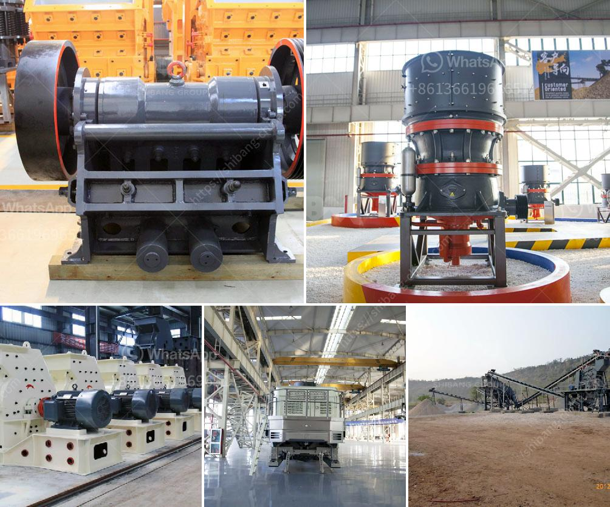

<h3>charano gold mining ghana</h3>
Charano Gold Mining, located in Ghana, is a leading player in the country's thriving mining industry. This article sheds light on the operations of Charano, highlighting its significance within the sector, the potential benefits it brings to Ghana, as well as some of the challenges it faces.

Gold mining in Ghana has been a vital industry for decades, contributing significantly to the nation's economic growth. Charano Gold Mining has emerged as a key player within this sector, exploiting Ghana's rich gold deposits through its extraction operations. These operations directly contribute to employment creation, fostering economic growth, and improving the livelihoods of local communities.

Charano's mining activities have made Ghana one of the largest gold producers in Africa. The revenue generated from gold exports has played a pivotal role in the country's balance of trade, contributing to foreign exchange reserves and supporting the development of vital infrastructure projects.

Mining, including gold extraction, comes with inherent challenges. Environmental impact is a primary concern, as mining activities often disrupt ecosystems and alter landscapes. Charano Gold Mining, like many others in the industry, must adhere to stringent regulations and adopt sustainable practices to mitigate environmental damage.

Additionally, mining regions often face social challenges, including displacement of communities and strained local resources. Charano endeavors to work closely with the communities in which it operates, engaging in corporate social responsibility initiatives to support education, healthcare, and infrastructure development. Open dialogue and collaboration with stakeholders are key to addressing concerns and building mutually beneficial relationships.

Ghana's government is proactive in creating an enabling environment for mining companies like Charano Gold Mining. Stable political leadership and a transparent regulatory framework have attracted significant foreign investment to the sector. However, the government is continuously revising regulations to enhance environmental and social standards.

Charano Gold Mining's presence in Ghana has been transformative both in economic and social aspects. Through responsible mining practices, it has harnessed the nation's gold resources and contributed to its economic growth. However, the industry must remain vigilant in balancing profits with environmental conservation and social well-being. By addressing these challenges, Charano Gold Mining can continue to thrive while contributing to Ghana's development.
<h3>Contact us</h3><ul><li><strong>Whatsapp:&nbsp;<a href="https://wa.me/8613661969651">+8613661969651</a></strong></li><li><a href="https://swt.shibang-china.com/?git&amp;zhl&amp;charano gold mining ghana"><strong>Online Service(chat now)</strong></a></li></ul><h3>Related</h3><ul><li><a href='how to make a mineral crushing machine.md'>how to make a mineral crushing machine</a></li><li><a href='crusher manufacturers in peru.md'>crusher manufacturers in peru</a></li><li><a href='price of aggregate crusher machine in ethiopia.md'>price of aggregate crusher machine in ethiopia</a></li><li><a href='crushing equipment from.md'>crushing equipment from</a></li><li><a href='stone crusher in himachal pradesh.md'>stone crusher in himachal pradesh</a></li></ul>