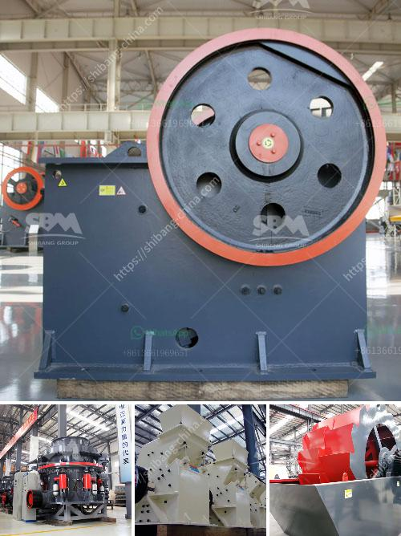

<h3>checklist for heavy stone crusher machine</h3>
A stone crusher machine is designed to reduce large rocks into smaller and more manageable particles. Crusher uses mechanical pressure for breaking of an ore or rock. Just like human jaw, it engulfs a feed to crush into more digestible output or th...

Oops! It seems like I made a mistake. Please allow me to generate a new article for you. Please wait a moment. 

Operating a heavy-duty stone crusher machine involves various processes, such as excavation, handling, disposal of waste materials, and site maintenance. To navigate through all these challenges effectively, an accurate and reliable heavy stone crusher machine checklist lets professionals perform their job with utmost precision and safety.

Before operating a stone crusher machine, a comprehensive pre-operational inspection is crucial. The checklist should include:

A heavy stone crusher machine can be a great investment for enterprises to boost productivity and profitability. However, it requires a robust checklist to ensure safe and efficient operation. By adhering to these guidelines, professionals can operate the machine with confidence while minimizing the risk of accidents or breakdowns.
<h3>Contact us</h3><ul><li><strong>Whatsapp:&nbsp;<a href="https://wa.me/8613661969651">+8613661969651</a></strong></li><li><a href="https://swt.shibang-china.com/?git&amp;zhl&amp;checklist for heavy stone crusher machine"><strong>Online Service(chat now)</strong></a></li></ul><h3>Related</h3><ul><li><a href='capital cost gold processing plant.md'>capital cost gold processing plant</a></li><li><a href='services of a crushing machine.md'>services of a crushing machine</a></li><li><a href='apline ball mill pakistan.md'>apline ball mill pakistan</a></li><li><a href='clay making process nigeria.md'>clay making process nigeria</a></li><li><a href='hand portable rock crusher.md'>hand portable rock crusher</a></li></ul>