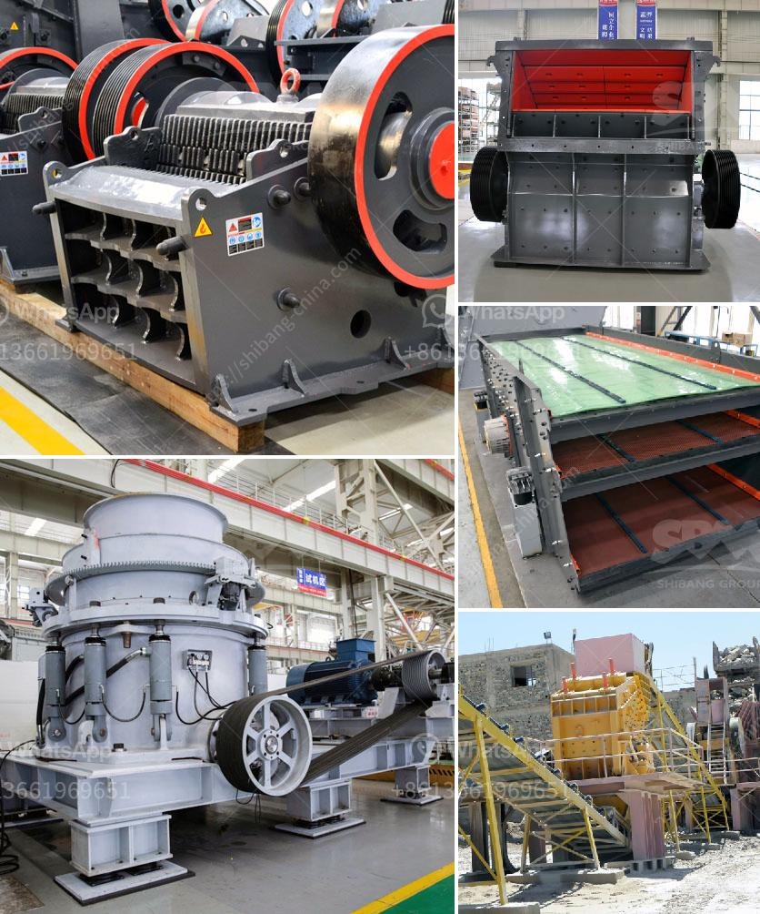

<h3>chili powder grinding machinery</h3>
Chili powder is a popular spice used in various cuisines around the world. It adds a rich and spicy flavor to dishes and can elevate the taste of any meal. To produce high-quality chili powder, grinding machinery is essential.

Chili powder grinding machinery is a machine that is specifically designed to grind chili peppers into a fine powder. This process is highly efficient and ensures the integrity of the flavor and aroma of the chili powder. It also helps in preserving the valuable nutrients present in the chili peppers.

There are various types of chili powder grinding machinery available in the market. One common type is the hammer mill. This equipment consists of a rotor with swinging hammers that crush the chili peppers into small particles. The particles are then further ground into a fine powder using screens of different mesh sizes.

Another type of chili powder grinding machinery is the cryogenic grinder. This machine uses liquid nitrogen to freeze the chili peppers before grinding them. The frozen chili peppers are then pulverized into a fine powder, ensuring minimum loss of flavor and color.

The advantages of using chili powder grinding machinery are numerous. Firstly, it saves time and effort compared to manual grinding. These machines are designed to handle a large volume of chili peppers, making the grinding process much faster and efficient.

Secondly, grinding machinery ensures consistency in the quality of the chili powder. The machines are calibrated to grind the chili peppers into a specific particle size, resulting in a uniform powder. This consistency ensures that every batch of chili powder has the same flavor profile.

Lastly, grinding machinery enhances food safety and hygiene. The equipment is made from food-grade materials that are easy to clean and maintain. This reduces the risk of contamination and ensures the production of safe and hygienic chili powder.

In conclusion, chili powder grinding machinery is an essential tool for any chili powder production facility. It improves efficiency, preserves flavor and aroma, ensures consistency, and enhances food safety. Investing in a high-quality grinding machine is crucial to achieve the best results and produce top-notch chili powder.
<h3>Contact us</h3><ul><li><strong>Whatsapp:&nbsp;<a href="https://wa.me/8613661969651">+8613661969651</a></strong></li><li><a href="https://swt.shibang-china.com/?git&amp;zhl&amp;chili powder grinding machinery"><strong>Online Service(chat now)</strong></a></li></ul><h3>Related</h3><ul><li><a href='cost of tons per hour crusher plant in india.md'>cost of tons per hour crusher plant in india</a></li><li><a href='slag grinding machine in india.md'>slag grinding machine in india</a></li><li><a href='mobile jaw crusher for sale.md'>mobile jaw crusher for sale</a></li><li><a href='small stone crushers ontario canada.md'>small stone crushers ontario canada</a></li><li><a href='technical specification for ball mill.md'>technical specification for ball mill</a></li></ul>