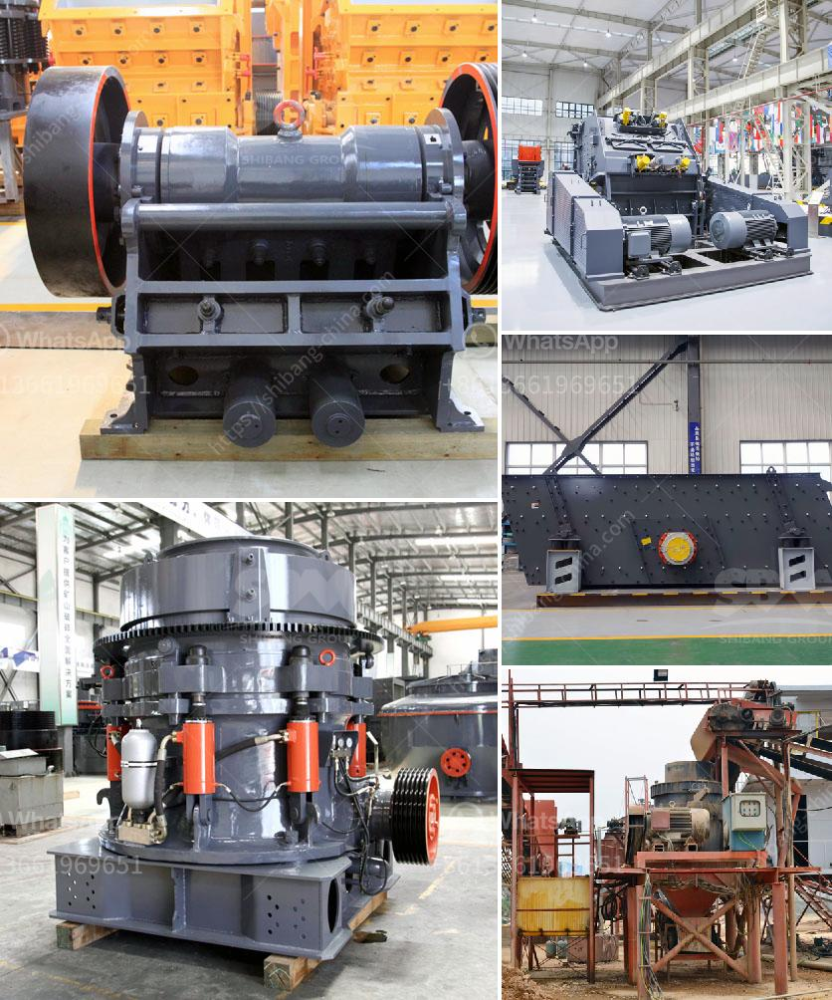

<h3>china clay washing equipment for sale</h3>
China clay, also known as kaolin clay, is a natural clay mineral with a soft texture and earthy colors. It is widely used in various industries, such as paper, ceramics, cosmetics, and pharmaceuticals. To meet the growing demand for processed china clay, advanced washing equipment is employed to remove impurities and achieve a high level of purity.

China clay washing equipment plays a crucial role in the production of high-quality clay products. They ensure efficient and thorough removal of impurities before the clay goes through further processing. These machines are designed to wash, separate, and dewater the clay while retaining its desirable properties.

One of the key features of china clay washing equipment is their ability to remove fine particles such as silt and clay from the material. These fine particles can negatively impact the quality and properties of the processed clay. With the use of advanced washing techniques, including attrition scrubbing and gravity separation, these machines effectively eliminate impurities and achieve a desirable level of cleanliness.

China clay washing equipment is available in various types and models, catering to different production requirements. One popular type is the log washer, which is specifically designed for clay washing and scrubbing. It consists of a large tub or barrel, where the clay and water are mixed together and vigorously agitated to remove impurities. The rotation of the log helps break down lumps, disperse clays, and thoroughly clean the material.

Another commonly used equipment is the sand screw, which is ideal for washing, dewatering, and classifying fine particles. It uses a rotating screw to lift the clay mixture, separate it from water, and discharge the cleaned clay while retaining water for reuse. This equipment ensures minimal loss of the valuable clay material and efficient removal of impurities.

China clay washing equipment is also equipped with advanced features to enhance productivity and efficiency. These include adjustable water spray systems, variable speed drives, and automated controls. These technologies enable operators to optimize the washing process, adjust settings according to the clay's characteristics, and achieve desired results consistently.

In addition to efficient clay washing, these machines also contribute to environmental sustainability. They incorporate water recycling systems that minimize water consumption and reduce the environmental impact. By reusing water in the washing process, these equipment not only save natural resources but also lower operational costs.

China clay washing equipment is in high demand across various industries due to its ability to produce clean and high-quality clay products. Manufacturers and suppliers offer a wide range of equipment options to meet specific requirements. Whether it's a small-scale operation or a large production facility, there is suitable washing equipment available for sale.

In conclusion, china clay washing equipment is essential for processing clay minerals and achieving a high degree of purity. These machines effectively remove impurities, such as silt and clay particles, ensuring cleanliness and quality in the final product. With advanced features and water recycling systems, they contribute to efficient operations and environmental sustainability. Manufacturers and suppliers offer a variety of equipment options to cater to different production needs, making china clay washing equipment readily available for sale.
<h3>Contact us</h3><ul><li><strong>Whatsapp:&nbsp;<a href="https://wa.me/8613661969651">+8613661969651</a></strong></li><li><a href="https://swt.shibang-china.com/?git&amp;zhl&amp;china clay washing equipment for sale"><strong>Online Service(chat now)</strong></a></li></ul><h3>Related</h3><ul><li><a href='silica water washing plant manufacturers in india.md'>silica water washing plant manufacturers in india</a></li><li><a href='cone crusher in the philippines.md'>cone crusher in the philippines</a></li><li><a href='how much does it cost to set up a mini cement plant.md'>how much does it cost to set up a mini cement plant</a></li><li><a href='silica quartz crushing plant.md'>silica quartz crushing plant</a></li><li><a href='mobile crusher tph.md'>mobile crusher tph</a></li></ul>