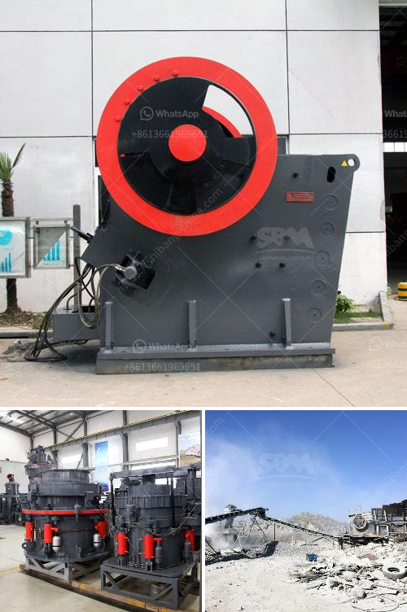

<h3>china clay washing equipment sale supplier</h3>
China clay, also known as kaolin, is a fine white clay that is widely used in various industries including ceramics, paper, rubber, and cosmetics. However, before it can be used in these applications, the clay needs to be processed. This is where china clay washing equipment comes in.

China clay washing equipment refers to the equipment used for washing clay-bearing ore before further processing. The common equipment includes bucket wheel spiral classifier and dewatering screen. These devices can effectively remove impurities, such as sand, mica and other clay particles, and guarantee the quality of the final product.

When it comes to china clay washing equipment, there are many suppliers to choose from. However, one supplier that stands out from the crowd is [Supplier Name]. They have been in the industry for [number of years] and have established a strong reputation for providing high-quality washing equipment.

One of the reasons why [Supplier Name] is highly regarded among customers is their commitment to innovation. They constantly invest in research and development to improve their equipment's efficiency and performance. This ensures that customers can achieve optimal results while saving time and resources.

In addition, [Supplier Name] not only offers top-notch equipment but also provides excellent after-sales service. They have a team of experienced technicians who can provide technical support and maintenance assistance whenever needed. This ensures that customers can rely on their equipment for the long run without any interruption to their production process.

Furthermore, [Supplier Name] understands the specific needs and requirements of different industries. They can customize their washing equipment based on the unique characteristics of the clay ore, ensuring that customers get the most suitable solution for their application.

In conclusion, if you are looking for a reliable supplier of china clay washing equipment, [Supplier Name] is definitely worth considering. With their innovative equipment, excellent after-sales service, and customization options, they can meet your specific needs and help you achieve high-quality clay products.
<h3>Contact us</h3><ul><li><strong>Whatsapp:&nbsp;<a href="https://wa.me/8613661969651">+8613661969651</a></strong></li><li><a href="https://swt.shibang-china.com/?git&amp;zhl&amp;china clay washing equipment sale supplier"><strong>Online Service(chat now)</strong></a></li></ul><h3>Related</h3><ul><li><a href='ball mill hammer mill.md'>ball mill hammer mill</a></li><li><a href='clay crusher machine in india.md'>clay crusher machine in india</a></li><li><a href='hand stone crushing machines uganda.md'>hand stone crushing machines uganda</a></li><li><a href='stone crusher machine size 100 x 100 cm.md'>stone crusher machine size 100 x 100 cm</a></li><li><a href='stone crusher in himachal pradesh.md'>stone crusher in himachal pradesh</a></li></ul>