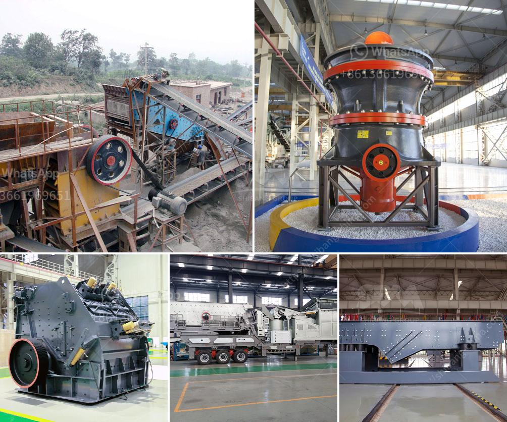

<h3>china mini rock crusher</h3>
The mini rock crusher, also known as a small-scale stone crushing machine, is widely used in the mining industry. With its efficient and user-friendly design, the machinery is able to process various materials, including rocks, gold, and other minerals.

Underground mining operations are becoming more common, as these sites require highly efficient equipment that can withstand the harsh conditions. With its compact design, the mini rock crusher can be easily transported, making it an essential piece of machinery for the mining industry.

China is known for its advanced technology in the mining industry. It has been a leading supplier of mining equipment for many years. The mini rock crusher price is affordable and competitive.

The mini rock crusher in mining machinery market is widely applied to crush high hardness ,mid hardness and soft rocks and ores such as slag, construction materials, marble ,etc, whose pressure resistance strength is under 200Mpa. The option of the jaw crusher for sale is dependant on the requirement of the crushing plant. As demand for mining machinery continues to grow, small jaw crusher, jaw crusher machine and other crushers have both economic contribution and efficient services. To become excellent supplier of China sandstone industry is the focus. Henan Hongxing brand is the China Famous Brand, and Hongxing believes that reliable and stable quality is the key to success. Our products like small jaw crusher are deemed to have reliable performance. Users trust their stability, and we hope that the mining machinery manufacturers could recognize our products.

China mini rock crusher is a perfect combination of compactness, durability, and performance. It is easy to install and operate, making it a versatile choice for various mining operations. Furthermore, the use of mini rock crusher can enhance the production efficiency and lower energy consumption, ensuring the economic benefit from the long-term perspective.

China's mining industry has been adhering to the principle of sustainable development and active participation in international cooperation. The mini rock crusher price provided by Hongxing company is not only reasonable and competitive, but also low. If you want to know the specific price of Hongxing rock crusher, please contact us!
<h3>Contact us</h3><ul><li><strong>Whatsapp:&nbsp;<a href="https://wa.me/8613661969651">+8613661969651</a></strong></li><li><a href="https://swt.shibang-china.com/?git&amp;zhl&amp;china mini rock crusher"><strong>Online Service(chat now)</strong></a></li></ul><h3>Related</h3><ul><li><a href='mobile crusher tph.md'>mobile crusher tph</a></li><li><a href='sand quarry plant.md'>sand quarry plant</a></li><li><a href='quarry business plan sample.md'>quarry business plan sample</a></li><li><a href='equipments used in cement industry.md'>equipments used in cement industry</a></li><li><a href='shaft hammer crusher hds.md'>shaft hammer crusher hds</a></li></ul>