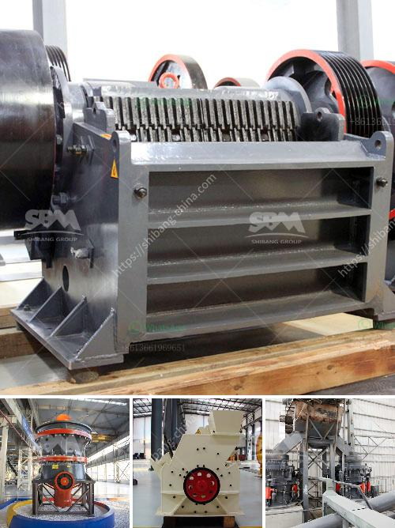

<h3>china vertical roller mill prices</h3>
China is the world's largest producer and consumer of cement, accounting for nearly 60% of global cement production. With such a massive demand for cement, it is no wonder that China is at the forefront of technological advancements in cement manufacturing equipment. One such innovation is the vertical roller mill, a grinding mill that reduces raw materials into powdered form through agitation and grinding.

Vertical roller mills have gained popularity in recent years due to their superior efficiency and low energy consumption compared to traditional ball mills. This milling machine has a vertical orientation and uses hydraulics to control the grinding force, allowing for precise control of the particle size distribution. Moreover, the vertical roller mill can handle a wide range of materials, including limestone, coal, and slag, making it ideal for use in cement plants.

In China, the market for vertical roller mills is booming. With the government's push for greener and more sustainable infrastructure projects, cement plants are investing in these efficient machines to optimize their operations. Consequently, the prices of vertical roller mills in China have been steadily decreasing, making them even more attractive to cement manufacturers.

The average price range of vertical roller mills in China varies from 500,000 to 5 million yuan ($75,000 to $750,000) depending on the specifications and capacity of the machine. Smaller mills with a production capacity of around 50 tons per hour are more affordable, while larger mills that can produce over 100 tons per hour are on the higher end of the price range. 

Considering the significant energy savings and reduced maintenance costs associated with vertical roller mills, the investment in these machines pays off in the long run. With the continuous advancements in technology and manufacturing processes, it is expected that the prices of vertical roller mills will continue to decrease, making them even more accessible to cement manufacturers in China.

As China continues to lead the world in cement production, the demand for efficient and cost-effective equipment like vertical roller mills will remain strong. Cement manufacturers in China should consider investing in these innovative machines to optimize their operations and stay ahead in the competitive market.
<h3>Contact us</h3><ul><li><strong>Whatsapp:&nbsp;<a href="https://wa.me/8613661969651">+8613661969651</a></strong></li><li><a href="https://swt.shibang-china.com/?git&amp;zhl&amp;china vertical roller mill prices"><strong>Online Service(chat now)</strong></a></li></ul><h3>Related</h3><ul><li><a href='silica sand manufacturing process.md'>silica sand manufacturing process</a></li><li><a href='roller crusher in egypt.md'>roller crusher in egypt</a></li><li><a href='crusher plant equipment supplier in saudi arabia.md'>crusher plant equipment supplier in saudi arabia</a></li><li><a href='production of barium sulfate main plant equipment.md'>production of barium sulfate main plant equipment</a></li><li><a href='functions conical crusher.md'>functions conical crusher</a></li></ul>