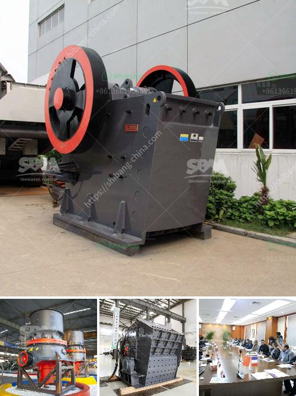

<h3>chinese gypsum production line equipment</h3>
Gypsum, also known as calcium sulfate, is a widely used industrial material. It plays an essential role in various industries, such as construction, agriculture, and chemical. With the increasing demands for gypsum products, the efficient production of gypsum has become a crucial aspect to consider.

Chinese gypsum production line equipment has been widely recognized for its high quality and efficient performance. In this article, we will take a closer look at some of the essential equipment used in gypsum production lines in China.

The crusher is responsible for the initial crushing of raw gypsum. It is often used as a primary crusher and works by compressing the gypsum into smaller pieces. The crusher not only ensures the smooth functioning of the subsequent equipment but also increases the efficiency of the overall gypsum production line.

After the initial crushing, gypsum needs to be ground to a fine powder size for further processing. A grinding mill is used for this purpose. It grinds the crushed gypsum into a fine powder, making it suitable for various applications. The grinding mill in Chinese gypsum production lines is known for its high efficiency and accuracy, ensuring a consistent and high-quality output.

Calcination is an essential step in gypsum processing, where the raw gypsum is heated to remove excess water, resulting in a product known as "calcined gypsum." This process is carried out in a calcination system. Chinese manufacturers offer advanced calcination systems with precise temperature control, ensuring the production of high-quality calcined gypsum.

The drying system is responsible for removing the remaining moisture from gypsum products. It is a critical step to prevent any potential issues, such as mold growth, during storage. Chinese gypsum production lines are equipped with advanced drying systems that efficiently remove moisture, resulting in high-quality and durable gypsum products.

Once the gypsum products are produced, they need to be properly packaged and transported. Chinese gypsum production line equipment includes packaging and transportation systems that ensure the safe handling and delivery of gypsum products to customers. These systems are designed to minimize product damage and optimize efficiency.

Chinese gypsum production line equipment stands out for its superior quality and advanced technology. Chinese manufacturers have invested heavily in research and development to produce equipment that meets international standards. Additionally, the competitive pricing of Chinese equipment makes it attractive for buyers worldwide.

In conclusion, Chinese gypsum production line equipment offers efficient and reliable solutions for the production of high-quality gypsum products. The diverse range of equipment, including crushers, grinding mills, calcination systems, drying systems, and packaging systems, highlights the comprehensive approach adopted by Chinese manufacturers. As the demand for gypsum products continues to rise, investing in Chinese gypsum production line equipment can be a smart choice for businesses worldwide.
<h3>Contact us</h3><ul><li><strong>Whatsapp:&nbsp;<a href="https://wa.me/8613661969651">+8613661969651</a></strong></li><li><a href="https://swt.shibang-china.com/?git&amp;zhl&amp;chinese gypsum production line equipment"><strong>Online Service(chat now)</strong></a></li></ul><h3>Related</h3><ul><li><a href='simple diagram for high energy ball milling.md'>simple diagram for high energy ball milling</a></li><li><a href='activated carbon plant business plan.md'>activated carbon plant business plan</a></li><li><a href='hammer mills used in gold mining.md'>hammer mills used in gold mining</a></li><li><a href='grinding mill made in germany.md'>grinding mill made in germany</a></li><li><a href='crusher machine in bhutan.md'>crusher machine in bhutan</a></li></ul>