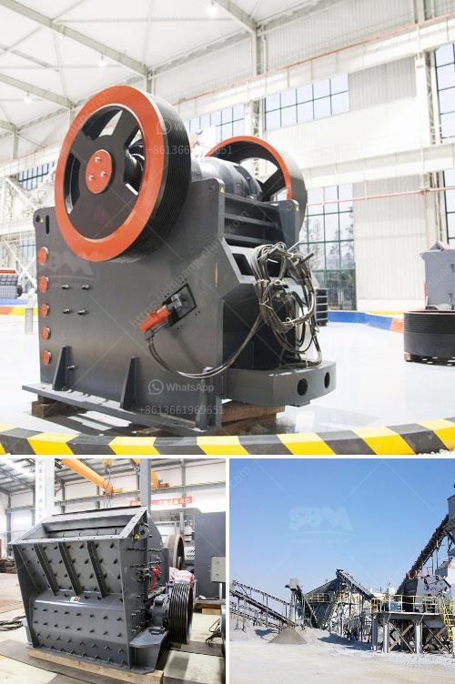

<h3>chrome crusher philippines</h3>
In today's fast-paced world, it is essential to have appliances that not only make our lives easier but also add a touch of style to our homes. One such appliance that has gained immense popularity in recent years is the Chrome Crusher Philippines. This innovative and aesthetically pleasing product has quickly become a must-have for every modern kitchen.

The Chrome Crusher Philippines is a compact and powerful appliance that effortlessly crushes ice to perfection. Whether you want to enjoy chilled drinks or create delicious homemade frozen cocktails, this appliance is the perfect solution. With a sturdy design and durable construction, the Chrome Crusher Philippines guarantees long-lasting performance, making it a valuable addition to any kitchen.

One of the standout features of the Chrome Crusher Philippines is its user-friendly operation. With just a push of a button, you can easily crush ice in a matter of seconds. This makes it convenient and time-efficient, especially when hosting parties or entertaining guests. You no longer have to spend excessive time manually crushing ice or settle for chunky ice cubes in your drinks.

Furthermore, the Chrome Crusher Philippines boasts a sleek and modern design that adds elegance to any kitchen decor. Its chrome finish and compact size make it a stylish addition to any countertop, further enhancing the overall aesthetic appeal of your kitchen. The appliance's versatility allows it to blend seamlessly with any existing appliances or home decor, making it an excellent investment for those who value both style and functionality.

In addition to its impressive features, the Chrome Crusher Philippines is also reasonably priced, making it accessible to a wide range of consumers. Its affordability, coupled with its exceptional performance, makes it a practical choice for anyone who wants to elevate their ice-crushing experience without breaking the bank.

To conclude, the Chrome Crusher Philippines is a game-changer in the world of kitchen appliances. Its efficiency, user-friendly design, and stylish aesthetics make it a must-have for every modern kitchen. Whether you are a professional mixologist or simply love hosting gatherings, this appliance will undoubtedly make a significant difference in your ice-crushing experience. So, why settle for mediocre ice cubes when you can have perfectly crushed ice with the Chrome Crusher Philippines? Upgrade your kitchen today and enjoy refreshing drinks like never before.
<h3>Contact us</h3><ul><li><strong>Whatsapp:&nbsp;<a href="https://wa.me/8613661969651">+8613661969651</a></strong></li><li><a href="https://swt.shibang-china.com/?git&amp;zhl&amp;chrome crusher philippines"><strong>Online Service(chat now)</strong></a></li></ul><h3>Related</h3><ul><li><a href='output size for a jaw crusher.md'>output size for a jaw crusher</a></li><li><a href='estimated budget for a conveyor belt.md'>estimated budget for a conveyor belt</a></li><li><a href='sand core making machine.md'>sand core making machine</a></li><li><a href='course in maintenance of stone crushers.md'>course in maintenance of stone crushers</a></li><li><a href='list of mini cement plants in gujarat.md'>list of mini cement plants in gujarat</a></li></ul>