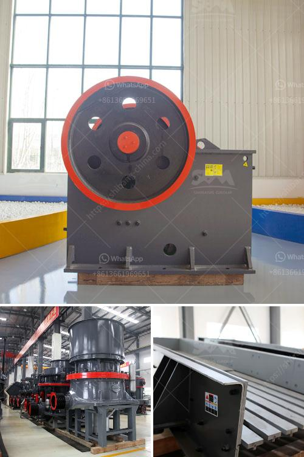

<h3>chrome ore mining plant sudan</h3>
Chrome ore is one of the key minerals produced by Sudan, encompassing both the mining and exporting sectors. Chrome is an important component used in manufacturing stainless steel and other alloys. Sudan boasts 944,000 metric tons of chrome ore reserves, ranking it as the 11th largest producer and 2nd largest exporter of the mineral in Africa, following South Africa.

Sudan's chrome mining industry has experienced significant growth over the years due to the development of mining infrastructure and a supportive government policy. The country has witnessed an influx of international mining companies, which have established mines and processing plants to extract and process the chrome ore.

One prominent chrome ore mining company in Sudan is the Al-Rawabit International Company. This company utilizes advanced mining technologies and equipment to extract chrome ore from the Ingessana Hills, located in the Blue Nile State. The company operates a state-of-the-art chrome ore processing plant, which ensures a consistent and high-quality final product. The plant comprises a crushing circuit, ore sorting facility, grinding circuit, and gravity concentrators to produce chrome concentrates with a grade of over 45%.

The chrome mining industry in Sudan has faced numerous challenges, including fluctuating global chrome prices and increasing competition from other countries. However, the government of Sudan has implemented favorable policies to attract investment and foster the growth of the industry. These policies include tax incentives, provision of mining licenses, and land allocation for mining activities.

Moreover, Sudan's chrome mining industry has significant economic benefits for the country. It provides employment opportunities for the local population, contributing to poverty alleviation and sustainable economic growth. Additionally, the export of chrome ore generates foreign exchange earnings for Sudan, enhancing its balance of payments.

The chrome mining industry also has environmental considerations. The extraction and processing of chrome ore can have environmental impacts, including land degradation and water pollution. To mitigate these impacts, mining companies in Sudan are required to implement environmental management plans and adhere to internationally recognized environmental standards. This ensures that the industry minimizes its negative effect on the environment and local communities.

In conclusion, the chrome ore mining plant in Sudan plays a crucial role in the country's socio-economic development. The presence of valuable chrome ore reserves, supportive government policies, and advanced mining technologies have attracted international mining companies to invest in Sudan's chrome mining industry. The industry not only provides employment and poverty alleviation but also contributes to the country's foreign exchange earnings. Furthermore, measures are being taken to mitigate the environmental impacts associated with chrome mining, ensuring sustainable development.
<h3>Contact us</h3><ul><li><strong>Whatsapp:&nbsp;<a href="https://wa.me/8613661969651">+8613661969651</a></strong></li><li><a href="https://swt.shibang-china.com/?git&amp;zhl&amp;chrome ore mining plant sudan"><strong>Online Service(chat now)</strong></a></li></ul><h3>Related</h3><ul><li><a href='gravel cone crusher for sale.md'>gravel cone crusher for sale</a></li><li><a href='copper concentrate ball mill for sale.md'>copper concentrate ball mill for sale</a></li><li><a href='belt conveyors used in crushing plant.md'>belt conveyors used in crushing plant</a></li><li><a href='vibrating screen prices.md'>vibrating screen prices</a></li><li><a href='gold recovery equipment for small mining companies.md'>gold recovery equipment for small mining companies</a></li></ul>