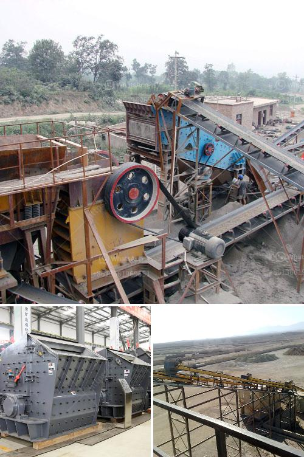

<h3>chromite ore crusher in pakistan</h3>
Chromite is a mineral that contains chromium. It is considered one of the essential elements for industrial use, especially in the manufacturing of stainless steel. With the help of its abundance in Pakistan, chromite ore reserves have attracted attention from several exploration companies. These reserves are found mainly in Balochistan province, where the chromite mining industry has flourished over the years.

The chromite ore crusher machines are essential in the production line and are designed to break the raw materials into small pieces and prepare them for further processing. The mobile crusher machine is in chrome crushing plant, which includes jaw crusher, cone crusher, impact crusher, and mobile crusher. They can be used for the primary, secondary, and tertiary crushing stages. The traditional jaw crusher is a great choice for primary crushing, while the impact crusher and cone crusher are excellent choices for secondary and tertiary crushing.

The chromite ore crusher in Pakistan plays an important role in the industrial sector. The crushed chromite is then utilized in many industries, including cement, ceramics, glass, refractory, chemical, and metallurgical industries. Pakistan also exports chromite to different countries, making it an essential revenue-generating mineral for the country.

The chromite ore crusher in Pakistan not only helps in improving the production efficiency but also reduces the overall energy consumption. With the advancements in technology, various crushers are manufactured to cater to all kinds of requirements. These crusher machines are equipped with advanced features like a hydraulic system, high crushing ratio, and a unique feeding structure to ensure maximum productivity.

In conclusion, the chromite ore crusher in Pakistan plays a crucial role in the industrial sector. The exploration of chromite ore reserves has opened up potential opportunities for economic growth in the country. It is imperative to continue the sustainable mining practices and invest in modern equipment to enhance productivity and meet the increasing global demand for chromite.
<h3>Contact us</h3><ul><li><strong>Whatsapp:&nbsp;<a href="https://wa.me/8613661969651">+8613661969651</a></strong></li><li><a href="https://swt.shibang-china.com/?git&amp;zhl&amp;chromite ore crusher in pakistan"><strong>Online Service(chat now)</strong></a></li></ul><h3>Related</h3><ul><li><a href='quartz plant and machinary.md'>quartz plant and machinary</a></li><li><a href='estimated cost for cement grinding mill.md'>estimated cost for cement grinding mill</a></li><li><a href='complete aggregate crushing plant in usa.md'>complete aggregate crushing plant in usa</a></li><li><a href='gypsum stone crusher machine.md'>gypsum stone crusher machine</a></li><li><a href='gold ore 300 550tph cs cone crusher for sale.md'>gold ore 300 550tph cs cone crusher for sale</a></li></ul>