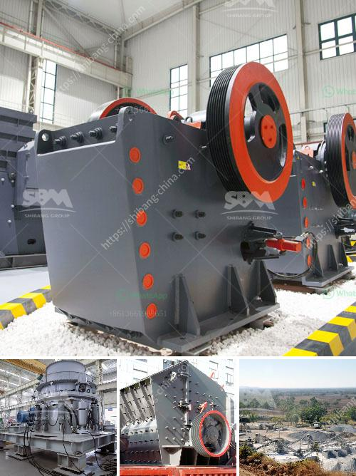

<h3>circuit stone cone crusher plant</h3>
The stone cone crusher plant is a highly efficient and versatile piece of machinery that has been developed for use in mining and construction industries. It is mainly used for the secondary and tertiary crushing of various kinds of materials. The stone cone crusher plant combines high production capacity and crushing efficiency, while also providing a versatile and reliable design that sets it apart from other crushing equipment.

One of the key features of the stone cone crusher plant is its closed circuit configuration. This allows the machine to perform at its optimal level, ensuring that the final product is of high quality and consistency. The closed circuit design means that the material is continually recycled within the crushing chamber until it reaches the desired size. This provides a significant reduction in the amount of waste material and increases the efficiency of the crushing process.

The stone cone crusher plant also includes various other components such as a feeder, vibrating screen, and conveyor belts. These auxiliary components work together to ensure a smooth and consistent flow of material throughout the crushing process. The feeder ensures that the material is evenly distributed onto the cone crusher, while the vibrating screen separates the material into different sizes. Finally, the conveyor belts transport the crushed material to the desired location.

In addition to its closed circuit configuration, the stone cone crusher plant also offers several other advantages. The robust design of the machine ensures its reliability and durability, even in the most demanding operating conditions. The cone crusher is equipped with high-quality bearings that ensure smooth operation, while the heavy-duty construction provides excellent resistance to wear and tear.

Furthermore, the stone cone crusher plant has a wide range of applications. It can be used for crushing various types of materials, including hard and abrasive rocks, limestone, and gravel. This versatility makes it suitable for use in different industries, such as mining, quarrying, and construction. The stone cone crusher plant can be configured to meet specific requirements, allowing for customization based on the desired product size and capacity.

Overall, the stone cone crusher plant is a reliable and efficient piece of equipment that offers numerous benefits. Its closed circuit configuration ensures high-quality and consistent production, while the robust design and versatile applications make it suitable for a variety of industries. Whether used in mining, quarrying, or construction, the stone cone crusher plant provides a reliable solution for crushing needs.
<h3>Contact us</h3><ul><li><strong>Whatsapp:&nbsp;<a href="https://wa.me/8613661969651">+8613661969651</a></strong></li><li><a href="https://swt.shibang-china.com/?git&amp;zhl&amp;circuit stone cone crusher plant"><strong>Online Service(chat now)</strong></a></li></ul><h3>Related</h3><ul><li><a href='stone crusher machine sale in zambia.md'>stone crusher machine sale in zambia</a></li><li><a href='cement plant for sale in india 200 tpd.md'>cement plant for sale in india 200 tpd</a></li><li><a href='ball mill laboratory philippines.md'>ball mill laboratory philippines</a></li><li><a href='hammer crusher birotor.md'>hammer crusher birotor</a></li><li><a href='used crusher rock mining germany.md'>used crusher rock mining germany</a></li></ul>