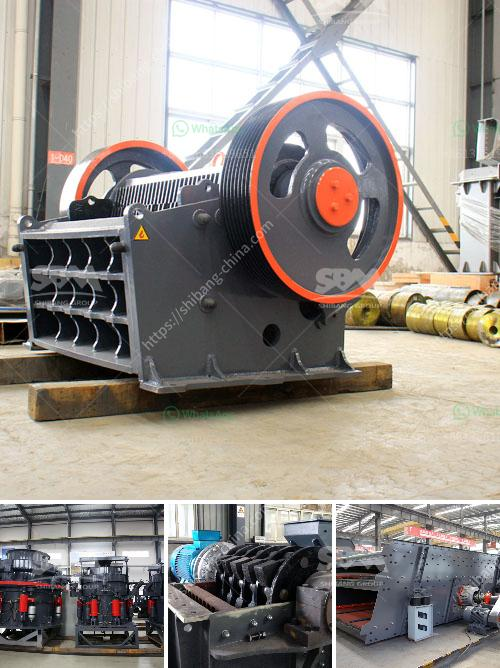

<h3>clay crusher price</h3>
Clay crusher is a combination of machines used to crush, grind, and shape clay materials that are commonly used for industrial applications. These machines are designed to reduce the size of clay and prepare it for further processing. The clay crusher price plays a significant role in determining the overall cost of these machines.

Industrial construction projects often require the use of clay in various forms, such as bricks, tiles, and ceramics. Clay possesses unique properties that make it suitable for these applications, including its ability to retain its shape when exposed to high temperatures. However, before it can be used, clay needs to undergo a series of processes, and this is where the clay crusher comes in.

The clay crusher helps in breaking down clay materials into smaller pieces or powders. It is an essential equipment piece in the clay processing industry, as it allows for efficient crushing and grinding of clay materials. The size reduction process carried out by the clay crusher enables the clay to be easily molded and shaped into different forms.

When purchasing a clay crusher, one of the factors that need to be considered is its price. The price of a clay crusher can vary depending on several factors, such as its production capacity, power consumption, and the brand or manufacturer. The production capacity determines the amount of clay that can be processed within a specific time frame, while power consumption affects operational costs.

Different clay crusher models are available in the market, each with its own set of features and specifications. Some crushers are designed for small-scale operations, such as home workshops or small construction projects, while others are suitable for large-scale industrial applications. The price of a clay crusher may vary depending on its intended use and the level of sophistication it offers.

In addition to production capacity and power consumption, the brand or manufacturer can also influence the clay crusher price. Well-known and reputable brands often charge a premium for their products due to their established reputation and reliability. On the other hand, lesser-known brands or manufacturers may offer similar performance at a lower price point.

When considering the clay crusher price, it is essential to look beyond the upfront cost. It is equally important to consider the long-term operational costs associated with the machine, such as maintenance, repairs, and spare parts. A cheaper upfront price may not necessarily translate into cost savings if the machine requires frequent repairs or has high maintenance requirements.

In conclusion, the clay crusher is an indispensable piece of equipment for industrial construction projects. Its role in crushing, grinding, and shaping clay materials cannot be overstated. When considering purchasing a clay crusher, the price should be one of the factors taken into account. However, it is equally important to consider the machine's production capacity, power consumption, and long-term operational costs. By weighing all these factors, one can make an informed decision and choose a clay crusher that offers the best value for money.
<h3>Contact us</h3><ul><li><strong>Whatsapp:&nbsp;<a href="https://wa.me/8613661969651">+8613661969651</a></strong></li><li><a href="https://swt.shibang-china.com/?git&amp;zhl&amp;clay crusher price"><strong>Online Service(chat now)</strong></a></li></ul><h3>Related</h3><ul><li><a href='stone crusher portable.md'>stone crusher portable</a></li><li><a href='gypsum board manufacturing plant cost india.md'>gypsum board manufacturing plant cost india</a></li><li><a href='raymond mills india.md'>raymond mills india</a></li><li><a href='crushing companies in the usa.md'>crushing companies in the usa</a></li><li><a href='jaw crusher 150 ton pricing.md'>jaw crusher 150 ton pricing</a></li></ul>