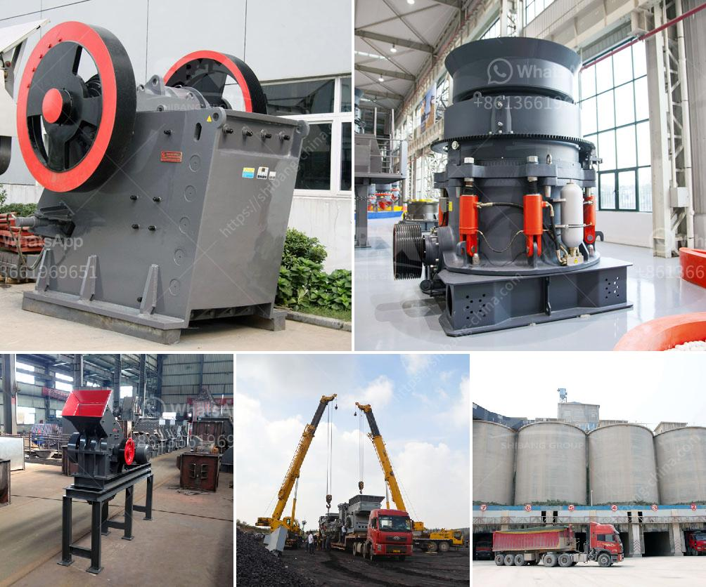

<h3>clay making process nigeria</h3>
Clay is a natural material that has been used for centuries by different cultures around the world to create pottery, sculptures, and other artistic pieces. In Nigeria, the process of clay making is not only a means to create functional and decorative items but also a way of preserving tradition and creating art.

One of the fascinating aspects of clay making in Nigeria is the use of age-old techniques that have been passed down through generations. Many villages in Nigeria still practice traditional methods of clay extraction and molding, allowing them to keep their cultural heritage alive. These techniques are deeply ingrained in the fabric of Nigerian society and often hold great significance within specific communities.

The clay making process in Nigeria typically starts with clay extraction. Clay is found in abundance in Nigeria, making it easily accessible for artisans and potters. In rural areas, locals dig up clay from riverbanks or large deposits in the ground. The clay is then brought to their workshops where it is processed and prepared for molding.

Once the clay is collected, it is dried in the sun to remove excess moisture. The dried clay is then broken down into smaller pieces and ground into a fine powder. This process ensures that the clay is of a consistent texture and free from impurities, making it easier to work with.

Next, the clay powder is mixed with water to create a workable clay paste. Artisans knead the clay, adding water as needed, until it reaches a smooth and pliable consistency. This clay is typically red or terracotta in color, giving Nigerian pottery its distinct appearance.

With the clay now ready, artisans can begin shaping it into various forms. Traditional Nigerian pottery often includes functional items such as bowls, plates, and pots, as well as decorative sculptures and masks. The pottery can be hand-formed or made using molds or a potter's wheel, depending on the artisan's preference and skill level.

As the clay objects take shape, artisans often incorporate their own artistic flair by applying intricate patterns and designs. They may use tools like fingers, wooden stamps, or carving tools to create unique textures and motifs on the clay surface. Some traditional designs draw inspiration from Nigerian folklore and the natural world, while others are more abstract or geometric in nature.

After the clay objects are shaped and decorated, they are left to dry thoroughly. The drying process can take several days or even weeks, depending on the size and thickness of the pottery. This step is crucial as it helps remove any remaining moisture from the clay, reducing the risk of cracking or breaking during firing.

Once fully dried, the pottery is fired in a kiln or an open fire. Firing the clay transforms it into a durable and long-lasting material, suitable for everyday use or display. Traditional kilns in Nigeria are often wood-fired or built from clay and brick, contributing to the authenticity and traditional nature of the pottery making process.

In conclusion, the clay making process in Nigeria is a fascinating blend of tradition, culture, and artistry. The age-old techniques used by Nigerian artisans not only create functional and decorative objects but also help preserve the country's rich cultural heritage. Through clay making, Nigerian artisans continue to showcase their skills, creativity, and connection to their ancestral roots, resulting in beautiful and meaningful pottery that celebrates Nigeria's unique artistic legacy.
<h3>Contact us</h3><ul><li><strong>Whatsapp:&nbsp;<a href="https://wa.me/8613661969651">+8613661969651</a></strong></li><li><a href="https://swt.shibang-china.com/?git&amp;zhl&amp;clay making process nigeria"><strong>Online Service(chat now)</strong></a></li></ul><h3>Related</h3><ul><li><a href='aggregate jaw crusher price.md'>aggregate jaw crusher price</a></li><li><a href='dolomite powder producing machinery.md'>dolomite powder producing machinery</a></li><li><a href='porur raymond grinding mill.md'>porur raymond grinding mill</a></li><li><a href='kaolin crushing processing in india.md'>kaolin crushing processing in india</a></li><li><a href='two prefabricated concrete production line.md'>two prefabricated concrete production line</a></li></ul>