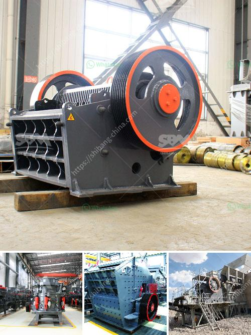

<h3>clay production plant</h3>
Clay has been a fundamental building material since ancient times, and its versatility and durability have stood the test of time. However, with the growing demand for rapid and efficient construction, traditional methods of clay production are struggling to keep up. This is where a clay production plant comes into play, revolutionizing the construction industry.

A clay production plant is a specialized facility that focuses on the extraction, refinement, and processing of clay for construction purposes. These plants are equipped with state-of-the-art machinery and employ advanced techniques that streamline the production process, ensuring a consistent supply of high-quality clay.

One of the key advantages of a clay production plant is its ability to optimize the extraction process. Traditional clay extraction involves manual labor and is often time-consuming and labor-intensive. In a clay production plant, however, modern machinery is utilized, making the extraction process more efficient and cost-effective. This ensures a higher output of clay with minimal disruptions to the environment.

Furthermore, the refinement and processing of clay are crucial steps in enhancing its usability as a building material. A clay production plant employs various techniques to eliminate impurities, such as organic matter and minerals, thereby improving the clay's strength and stability. This results in a consistent and superior-quality product that can be used in a wide range of construction applications, including bricks, tiles, and ceramics.

Another significant advantage of a clay production plant is its ability to meet the ever-increasing demands of the construction industry. As urbanization and population growth continue to surge, the need for sustainable and affordable housing is paramount. A clay production plant ensures a steady supply of clay, enabling construction companies to stay on schedule and fulfill their commitments. This, in turn, contributes to the overall growth and development of the construction industry.

Moreover, a clay production plant plays a crucial role in sustainable construction practices. Clay is a naturally occurring material, and its extraction has a relatively low environmental impact compared to other construction materials such as steel or concrete. By utilizing a clay production plant, construction companies can reduce their reliance on non-renewable resources, minimize carbon emissions, and promote eco-friendly building solutions.

In conclusion, a clay production plant is a game-changer for the construction industry. Through advanced extraction, refinement, and processing techniques, these plants provide a consistent supply of high-quality clay, meeting the demands of modern construction practices. The utilization of clay as a construction material is not only aesthetically pleasing but also sustainable, making it an ideal choice for builders and architects alike. With the advent of clay production plants, the construction industry is poised for a revolution, paving the way for innovative and eco-friendly building solutions.
<h3>Contact us</h3><ul><li><strong>Whatsapp:&nbsp;<a href="https://wa.me/8613661969651">+8613661969651</a></strong></li><li><a href="https://swt.shibang-china.com/?git&amp;zhl&amp;clay production plant"><strong>Online Service(chat now)</strong></a></li></ul><h3>Related</h3><ul><li><a href='stone crusher plants in mexico.md'>stone crusher plants in mexico</a></li><li><a href='crushers manufacturers in south africa.md'>crushers manufacturers in south africa</a></li><li><a href='diesel compressors for sale in south africa.md'>diesel compressors for sale in south africa</a></li><li><a href='gold separating machine for sale in south africa.md'>gold separating machine for sale in south africa</a></li><li><a href='portable hydraulic rock crusher.md'>portable hydraulic rock crusher</a></li></ul>