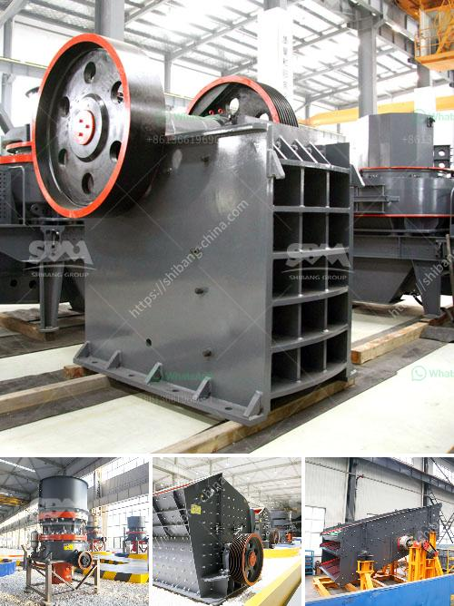

<h3>clinker crsher plant for sale</h3>
If you are in the construction industry or involved in any project that requires the use of cement, then you must be aware of the crucial role played by clinker crusher plants. These plants are responsible for crushing the raw materials to create a fine powder, known as clinker, which is the main component used in cement production.

However, setting up a clinker crusher plant can be a costly and time-consuming process. That is why finding a reliable and efficient clinker crusher plant for sale is of utmost importance. Fortunately, there are several options available in the market that cater to the diverse needs of different construction projects.

When looking for a clinker crusher plant for sale, it is essential to consider certain factors. The capacity of the plant is one of the crucial aspects to consider, as it will determine how much clinker can be produced in a given time frame. Generally, the capacity of a clinker crusher plant can range from 50 to 1000 tons per hour, depending on the size and scale of the construction project.

Another crucial factor to consider is the design and efficiency of the plant. It is essential to look for a plant that has a sturdy construction and is built to withstand the harsh conditions of a construction site. Additionally, the plant should have an efficient crushing system that can produce uniform-sized clinker with minimal energy consumption.

Further considerations include the availability of spare parts and after-sales service. A reliable supplier should provide easy access to spare parts and have a team of professionals who can provide prompt support and assistance in case of any issues or concerns.

In conclusion, finding the right clinker crusher plant for sale is crucial for any construction project that requires the use of cement. By considering factors such as capacity, design, efficiency, spare parts availability, and after-sales service, you can ensure that you invest in a reliable and efficient plant that will meet your specific project requirements.
<h3>Contact us</h3><ul><li><strong>Whatsapp:&nbsp;<a href="https://wa.me/8613661969651">+8613661969651</a></strong></li><li><a href="https://swt.shibang-china.com/?git&amp;zhl&amp;clinker crsher plant for sale"><strong>Online Service(chat now)</strong></a></li></ul><h3>Related</h3><ul><li><a href='stone crusher for concrete.md'>stone crusher for concrete</a></li><li><a href='coal conveyor problem.md'>coal conveyor problem</a></li><li><a href='hammer mill 200 mesh.md'>hammer mill 200 mesh</a></li><li><a href='ballast making machine kenya in kenya.md'>ballast making machine kenya in kenya</a></li><li><a href='cement clinker powder line.md'>cement clinker powder line</a></li></ul>