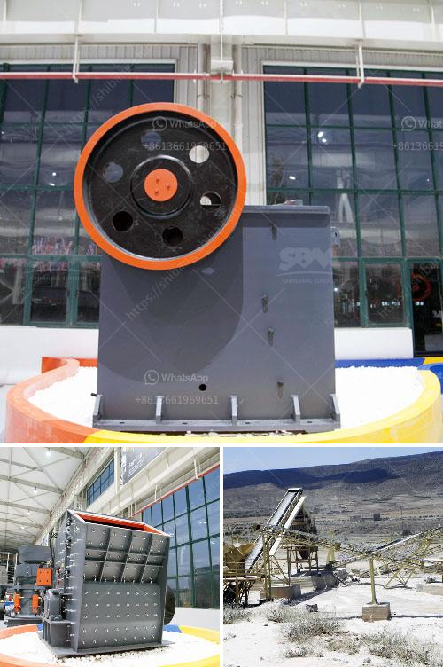

<h3>clinker grinding unit of 1000 tpd</h3>
Clinker refers to the final product obtained in cement manufacturing. It is the combination of limestone, clay, and iron ore that has been heated to a high temperature to form a solid substance. Clinker grinding is the process of adding gypsum to the clinker and crushing it into a fine powder. The final product is called cement.

A clinker grinding unit is a standalone factory that breaks large clinker pieces into smaller, manageable fragments for further transportation and processing. These units can be set up in different locations depending on availability of raw materials and market demand. A typical clinker grinding unit operates along the following stages:

1. Crushing: Large-sized clinker pieces are crushed into smaller fragments using crushers or hammer mills. This helps in reducing the clinker size and making it suitable for grinding.

2. Grinding: The crushed clinker is further ground into a powder-like substance. This is done in a ball mill, a vertical roller mill, or a roller press. The process results in grinding the clinker particles to a fine consistency, which enhances the reactivity and overall performance of the cement.

3. Packing: The ground clinker is now ready to be packed and transported. Depending on the market demand, it can be packed in bags or bulk containers. Proper packaging ensures that the cement remains intact and retains its quality during storage and transportation.

Setting up a clinker grinding unit of 1000 TPD (tons per day) requires substantial investment and infrastructure. The unit should have a robust layout, proper space utilization, and adequate facilities for material handling, grinding, storage, and packaging. Additionally, it should comply with local environmental regulations to minimize its impact on the surrounding ecosystem.

A clinker grinding unit of 1000 TPD has several advantages over smaller units. Firstly, it can cater to a larger market and meet higher demand. The economies of scale allow it to produce cement at a lower cost per unit. Secondly, it can take advantage of advanced technologies and equipment, resulting in higher productivity and efficiency. Lastly, setting up larger units promotes consolidation and streamlines the cement manufacturing process.

However, establishing such a unit also involves certain challenges. It requires significant capital investment, access to adequate raw materials, and skilled personnel to operate the machinery and maintain the unit. Moreover, market conditions and competition can influence the profitability and sustainability of the unit.

In conclusion, a clinker grinding unit of 1000 TPD plays a vital role in the cement manufacturing process. It helps in converting clinker into a fine powder, which is essential for producing high-quality cement. With careful planning and implementation, such units can contribute to the growth and success of the cement industry.
<h3>Contact us</h3><ul><li><strong>Whatsapp:&nbsp;<a href="https://wa.me/8613661969651">+8613661969651</a></strong></li><li><a href="https://swt.shibang-china.com/?git&amp;zhl&amp;clinker grinding unit of 1000 tpd"><strong>Online Service(chat now)</strong></a></li></ul><h3>Related</h3><ul><li><a href='quote for jaw crusher.md'>quote for jaw crusher</a></li><li><a href='how to make long lasting talcum powder.md'>how to make long lasting talcum powder</a></li><li><a href='ballast making machine kenya in kenya.md'>ballast making machine kenya in kenya</a></li><li><a href='quarry of stone crusher in pakistan pdf.md'>quarry of stone crusher in pakistan pdf</a></li><li><a href='conveyor belts in malaysia.md'>conveyor belts in malaysia</a></li></ul>