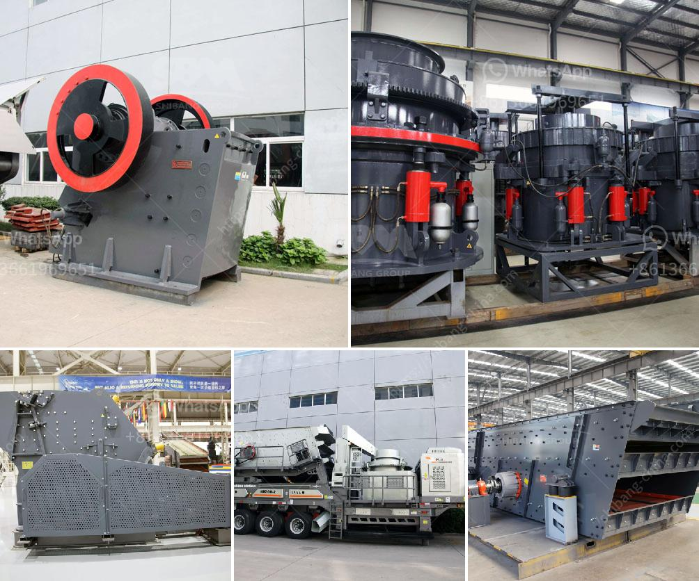

<h3>closing of crushing plant</h3>
In today's highly competitive business landscape, companies are constantly making tough decisions in order to remain profitable and sustainable. The closure of a crushing plant, due to economic and environmental considerations, serves as a prime example of this reality. In this article, we will explore the factors that led to the decision to close a crushing plant and its implications for the local community.

One of the key drivers behind the closure of the crushing plant was the changing economic landscape. Market demand for the crushed stone produced by the plant experienced a drastic decline over the years. This decline can be attributed to several factors, such as changes in construction practices and a shift towards alternative materials. As a result, the plant's profitability began to erode, making it increasingly difficult to sustain operations.

Moreover, the rising costs of maintaining and upgrading the outdated machinery in the facility added to the financial burden faced by the business. Despite efforts to streamline operations and cut costs, the closure of the crushing plant proved to be the most viable option for the company's long-term financial health.

Alongside economic factors, environmental concerns played a crucial role in the decision to close the crushing plant. Significant scrutiny and increasingly stringent regulations surrounding air and water pollution make it imperative for companies to prioritize environmental responsibility.

The crushing plant had been operating for several decades without significant updates to meet the evolving environmental standards. The emission levels of particulate matter, harmful gases, and noise generated by the plant exceeded acceptable limits outlined by environmental regulatory agencies. Such non-compliance not only posed significant risks to the environment but also exposed the company to legal and reputational consequences.

The closing of the crushing plant has had far-reaching consequences for the local community. Employees who were directly employed at the plant have lost their livelihoods, leading to increased unemployment in the area. This will undoubtedly have a detrimental effect on the community's economic well-being.

Additionally, the closure of the plant may have indirect impacts on related businesses in the local supply chain. Suppliers and service providers who relied on the plant's operations may also face financial challenges due to the termination of their business contracts.

The decision to close a crushing plant due to economic and environmental considerations is a testament to the complexities of today's business environment. With changing market demands, rising operational costs, and heightened environmental regulations, companies must carefully weigh these factors to ensure long-term viability. While these decisions may impact local communities and their residents, it is essential for companies to prioritize their financial stability and environmental responsibility. The management of such transitions should involve collaboration with community stakeholders to mitigate the negative consequences and explore alternative opportunities for sustainable development.
<h3>Contact us</h3><ul><li><strong>Whatsapp:&nbsp;<a href="https://wa.me/8613661969651">+8613661969651</a></strong></li><li><a href="https://swt.shibang-china.com/?git&amp;zhl&amp;closing of crushing plant"><strong>Online Service(chat now)</strong></a></li></ul><h3>Related</h3><ul><li><a href='hydraulic concrete crusher.md'>hydraulic concrete crusher</a></li><li><a href='buy quarry machine from europe.md'>buy quarry machine from europe</a></li><li><a href='silica sand washing plant.md'>silica sand washing plant</a></li><li><a href='china vertical roller mill prices.md'>china vertical roller mill prices</a></li><li><a href='chromite ore crusher in pakistan.md'>chromite ore crusher in pakistan</a></li></ul>